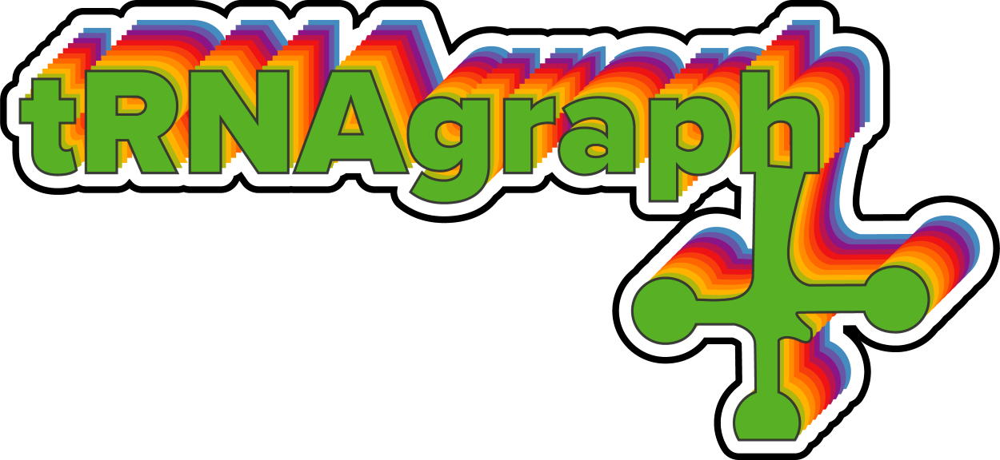
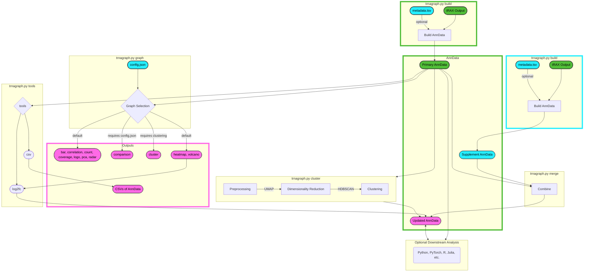

# tRNAgraph



[](https://www.gnu.org/licenses/gpl-3.0)
[](https://doi.org/10.5281/zenodo.14669314)

tRNAgraph is a tool for analyzing tRNA-seq data generated from tRAX. It can be used to create an [AnnData](https://anndata.readthedocs.io/en/latest/index.html) object from a tRAX coverage file or to analyze an existing database object and generate expanded visualizations. The database object can also be used to perform further analysis beyond the scope of what tRAX can do.

## About

[tRAX](https://github.com/UCSC-LoweLab/tRAX) is a tool often used for analyzing tRNA-seq data. While it generates a comprehensive set of results, it does not provide a way to visualize specific meta-data associated with a particular experiment. tRNAgraph is a tool that can be used to create a database object from a tRAX coverage file containing various experimental conditions not captured by tRAX. The database object can then be used to generate a variety of visualizations, including heatmaps, coverage plots, PCA plots, and more that are more specific to the experimental conditions of interest.



$\color{#51BD38}{\textsf{Primary Inputs}}$ - $\color{#25EEFF}{\textsf{Optional Inputs}}$ - $\color{#FF6AE6}{\textsf{Outputs}}$

## Installation

Dependencies can be installed using conda:

```bash
conda env create -f requirements.yaml
```

## Usage

### Activating the environment

```bash
conda activate tRNAgraph
```

tRNAgraph can be used with `build`, `cluster`, `merge`, `graph` and `tools` commands. The `build` command generates an AnnData object from a tRAX coverage file. The `graph` command creates visualizations from the database object. The `cluster` command is used to cluster the database object. The `merge` command is used to merge two database objects. The following sections will describe how to use each command.

### Input files

tRNAgraph will work a tRAX output directory and a metadatafile.

- **tRAX output must be generated with the Python3 Version >= `v1.1.0-beta`, older versions will given incorrect results!**
  - tRAX cannot use the `--nofrag` flag, as it will discard read associated information.

#### Metadata

You must attribute the meta-data associated with the samples if you want to generate graphs based on specific experimental conditions. To do this, you can provide a .tsv/.csv file (`-m/--metadatafile`) containing the sample names, sample groups, and any meta-data associated with the samples. This file must also include a header row with, at minimum, `sample` and `group` columns. The meta-data file can contain any number of additional columns corresponding to the experimental conditions you want to visualize. An example meta-data file is shown below:

```tsv
sample  group	celltype	treatment	condition
sample1 sampleGroup1 celltypeX treatmentA condition1
sample2 sampleGroup1 celltypeX treatmentA condition2
sample3 sampleGroup2 celltypeY treatmentB condition1
```

- If you wish to run the tool without providing any metadata, you can instead provide the [tRAX samples file](http://trna.ucsc.edu/tRAX/#step-3-analyze-sequencing-data-for-gene-expression) used to generate your tRAX run and add the header row to the top of the file. The samples file should contain the `sample group fastq` columns.
- If no header column for each observations is provided, then all observations will be annotated automatically as `obs_#` where `#` is the ordered observation.

### Build

The tRNAgraph.py script can be used to build a database object from a tRAX directory with the following command:

```bash
python trnagraph.py build -i <tRAX_directory> -s <tRAX_samples_file> -o <output_file> -l <list_of_observations>
```

- `-i` or `--traxdir` is the path to the tRAX directory you want to build an AnnData database object from.
- `-m` or `--metadata` is the path to the metadata file as described in the [metadata section](#metadata).
- `-o` or `--output` is the path to the output file. The output file should be a `.h5ad` file. By default, the output file will be named `h5ad/trnagraph.h5ad` if no path is provided.
- `--log` is used to output a log of the shell commands that generate the AnnData object. By default, the log will not be output.
- `-q` or `--quiet` suppresses the shell commands' output. By default, the output will be displayed.

### Cluster

The database object can be clustered using the `cluster` function. The following code will cluster the database object using [UMAP](https://umap-learn.readthedocs.io/en/latest/index.html) and cluster using [HDBSCAN](https://hdbscan.readthedocs.io/en/latest/index.html). The default parameters used in tRNAgraph work well on ARMseq, DM-tRNAseq, and OTTRseq data; however, each dataset is different and may require fine-tuning of the parameters to yield the best results. The following code will cluster the database object and save the result to a new database object:

```bash
python trnagraph.py cluster -i <input_database> -o <output_database>
```

Clustering is performed across the `uniquecoverage`, `readstarts`, `readends`, `mismatchedbases`, and `deletions` categories of the AnnData object. When performing clustering, verifying that it is reproducible and that the results reflect the data is important. This can be done by running the clustering multiple times and comparing the results. The clustering is also performed on `sample` and `group` observations. In the case of samples, every set of reads for every single tRNA is used for clustering. In the case of groups, the mean of the reads is taken for each tRNA across the read categories and then used for clustering. This is done to reduce the number of samples used for clustering and to reduce the noise in the clustering. The results will be saved in the `obs` attribute of the database object as `sample_cluster\umap1\umap2` and `group_cluster\umap1\umap2`, respectively. Clusters annotated as `-1` are considered noise and are not included in the clustering. Plotting of the clustering is done as well for convenience.

- `-i` or `--anndata` - The input database object.
- `-o` or `--output` - The output database object, if clustering was already performed on the input database object, the output database object must also be run with the `--overwrite` flag.
- `-w` or `--overwrite` - Whether to overwrite the output database object if it already contains clustering information.
- `-r` or `--randomstate` - Specify the random state for UMAP if you want to have a static seed (default: None) (optional). UMAP clustering should give reproducible results regardless of the random state. However, you may want to use a static seed to reproduce the same results for a particular dataset. It is important to verify that the clustering is reproducible before using a static seed.
- `-t` or `--readcutoff` - Specify read count cutoff for clustering (default: 15) (optional). This is the minimum number of reads required for a tRNA to be included in the clustering. This is useful for removing tRNAs not expressed in the dataset, as they can skew the clustering.
- `-c1` or `--ncomponentsmp` - Specify the number of components to use for UMAP clustering of samples (default: 2) (optional). This is the number of components to use for the UMAP clustering of the samples. Since this is independent of the number of components used for the UMAP plotting, you can use more components for clustering to get better results. This will need to be tuned for each dataset and depends on the variability of the dataset.
- `-c2` or `--ncomponentgrp` - Specify the number of components to use for UMAP clustering of groups (default: 2) (optional). See above.
- `-l1` or `--neighborclusmp` - Specify the number of neighbors to use for UMAP clustering of samples (default: 150) (optional). This is the number of neighbors to use for the UMAP clustering of the samples. This will need to be tuned for each dataset and depends on the variability of the dataset. A higher number of neighbors will generally yield a wider dispersion of the clusters across the projection.
- `-l2` or `--neighborclusgrp` - Specify the number of neighbors to use for UMAP clustering of groups (default: 40) (optional). See above.
- `-n1` or `--neighborstdsmp` - Specify the number of neighbors to use for UMAP projection plotting of samples (default: 75) (optional). See above.
- `-n2` or `--neighborstdgrp` - Specify the number of neighbors to use for UMAP projection plotting of groups (default: 20) (optional). See above.
- `-d1` or `--hdbscanminsampsmp` - Specify minimum sample size to use for HDBSCAN clustering of samples (default: 5) (optional). This is the minimum number of samples required to be considered a cluster.
- `-d2` or `--hdbscanminsampgrp` - Specify minsamples size for HDBSCAN group clustering (default: 3) (optional). See above.
- `-b1` or `--hdbscanminclusmp` - Specify the minimum cluster size for HDBSCAN sample clustering (default: 30) (optional). This is the minimum number of samples required to be considered a cluster.
- `-b2` or `--hdbscanminclugrp` - Specify the minimum cluster size for HDBSCAN group clustering (default: 10) (optional). See above.
- `--clusterobsexperimental` - Whether to use observations for clustering by incorporating them into the adata.X and adata.var.
  - NOTE!: This is an experimental test feature and should be used with caution. It is not recommended to use this feature unless you are familiar with the AnnData object and the clustering process and are certain that this is the desired behavior.
- `--log` is used to output a log of the shell commands that generate the clustered AnnData object. By default, the log will not be output.
- `-q` or `--quiet` suppresses the shell commands' output. By default, the output will be displayed.

When working with downstream analysis of the cluster groups, it is important to note that reads that are dropped via the `--readcutoff` flag will not be included in the clustering however, they are still present in the AnnData object. This means that your object can contain NaN values in the clustering columns. Depending on your use case, you may want to filter these out before performing any analysis.

### Merge

Two database objects can be merged using the `merge` function. The following code will merge two database objects and save the result to a new database object:

```bash
python trnagraph.py merge -i1 <input_database1> -i2 <input_database2> -o <output_database> 
```

- `-i1` or `--anndata1` - The first input database object.
- `-i2` or `--anndata2` - The second input database object.
- `-o` or `--output` The output database object.
- `--dropno` - Whether to drop samples not found in both nontRNA_counts files. By default, samples not found in both nontRNA_counts files are kept and filled with zeros.
  - Different sequencing methods and the input GTF for tRAX can yield vastly different results. To minimize this, it is recommended to use the same GTF file and sequencing method for both input files.
- `--droprna` - Whether to drop samples not found in both type_counts files. By default, samples not found in both type_counts files are kept and filled with zeros.
  - Different sequencing methods and the input GTF for tRAX can yield vastly different results. To minimize this, it is recommended to use the same GTF file and sequencing method for both input files.
- `--log` outputs a log of the shell commands used to generate the merged AnnData object. By default, the log will not be output.
- `-q` or `--quiet` suppresses the shell commands' output. By default, the output will be displayed.

### Graph

The tRNAgraph.py script can be used to generate a variety of visualizations from a database object with the following command:

```bash
python trnagraph.py graph -i <input_database> -o <output_directory> -g <graph_type> <graph_parameters>
```

- `-i` or `--anndata` is the path to the database object you want to generate visualizations from.
- `-o` or `--output` is the path to the output directory. The output directory will be named `figures` by default if no path is provided.
- `-g` or `--graph` is the type of graph to generate. The following graphs can be generated:
  - `bar` - Generates bar plots of the tRNA coverage.
  - `cluster` - Generates cluster plots of the tRNA coverage.
  - `compare` - Generates compare plots of the tRNA coverage.
  - `correlation` - Generates correlation plots of the tRNA coverage.
  - `count` - Generates count-bar plots of the tRNA amino and isotype distributions.
  - `coverage` - Generates coverage plots.
  - `heatmap` - Generates heatmaps of the differential tRNA expression.
  - `logo` - Generates seqlogos of the tRNA coverage.
  - `pca` - Generates PCA plots.
  - `radar` - Generates radar plots of the tRNA coverage.
  - `volcano` - Generates volcano plots of differential tRNA expression.
  - `all` - Generates all of the above plots. Exclude `compare` and `cluster` as they require additional parameters.
- `--config` is an optional flag to the path to a JSON file containing additional graph parameters. [See the configuration section below for more details.](#Configuration Files)
- `-n` or `--threads` is the number of threads to use for generating the graphs. By default, the number of threads will be set to the CPU_MAX. This is primarily useful for generating coverage plots and seqlogos as they can take a long time to generate. It will, however, run all non-threaded plots in parallel.
- `--log` is used to output a log of the shell commands used to generate the graphs. By default, the log will not be output.
- `-q` or `--quiet` suppresses the shell commands' output. By default, the output will be displayed.
- `-v` or `--verbose` is used to increase the verbosity of the output, including all flags used in the output. By default, the output will not be verbose.

The following parameters are optional and can be used to customize the graphs:

#### Bar Plots

- `--barcol` is the observation for grouping the bar plots into columns. If no observation is provided, the bar plots will be grouped by group.
- `--bargrp` is the observation for grouping the bar plot stacks. If no observation is provided, the bar plots will be stacked by amino group.
- `--barsubgrp` is the observation to use if you want to perform a secondary grouping of the bar plots. By default, this is disabled.
- `--barsort` is the observation for sorting the bar plots. If no observation is provided, the bar plots will be sorted by `--barcol` by default.
- `--barlabel` is the observation for labeling the bar plots. If no observation is provided, the bar plots will be labeled by `--barcol` by default.
  - This is useful if you want to label the bar plots with custom names such as manual annotations on top of hdbscan clusters.

#### Cluster Plots

- `--clustergrp` is the observation to use for coloring the cluster plots. If no observation is provided, the cluster plots will be colored by amino group.
- `--clusterlabels` is whether to include labels in the cluster plots. By default, this is disabled. If enabled, provide an AnnData observation for the labels, it doesn't have to be the same observation as the `--clustergrp` flag. This is useful if you have custom names for your HDBscan clusters.
- `--clusteroverview` is whether to generate a 2x2 overview of the cluster plots for amino, iso, readcount, and HDBscan cluster. By default, this is disabled. If enabled, the `--clustergrp` flag will be ignored.
- `--clusternumeric` is whether to use numeric values for the cluster plots. By default, this is disabled. Enabling this will plot a color bar with the numeric values in the legend.
- `--clustermask` is whether to mask the cluster plots by the HDBSCAN unclustered points. By default, this is disabled. Enabling this will plot the unclustered points in gray.

#### Compare Plots

- `--comparegrp1` is the observation for grouping the compare plots. If no observation is provided, the compare plots will be grouped by sample group.
- `--comparegrp2` is the observation for grouping the compare plots. If no observation is provided, the compare plots will be grouped by sample group.

#### Correlation Plots

- `--corrmethod` is the method to use for calculating the correlation. The following methods can be used:
- `pearson` - Pearson correlation coefficient.
- `spearman` - Spearman rank correlation.
- `kendall` - Kendall Tau correlation coefficient.

#### Coverage Plots

- `--covgrp` is the observation for grouping the coverage plots. If no observation is provided, the coverage plots will be grouped by sample group.
- `--covobs` is the observation used as the basis for each individual coverage plot. If no observation is provided, the coverage plots will be created per `trna`.
- `--covcombine` is whether to combine the coverage plots into a single plot of the mean for each observation within the group. Enabling this will disable the `--coveragegrp` flag, and the combined output will be given instead to the `combined` folder.
- `--covtype` is the type of tRNA coverage to plot, by default, it will plot unique coverage. All possible coverage types match the [tRAX coverage types](http://trna.ucsc.edu/tRAX/outputs/#abundance-of-trna-tdrs-and-other-genes).
- `--covgap` is whether to include tRNA gaps in the coverage plots. By default, tRNA gaps will be skipped in the coverage plots.
- `--combinedpdfonly` is whether to only generate the combined PDFs for the coverage plots. By default, the coverage plots for every `--covobs` will be generated.

#### Heatmap Plots

- `--heatgrp` is the observation for grouping the heatmap plots. If no observation is provided, the heatmap plots will be grouped by sample group.
- `--diffrts` is the read type for the heatmap/volcano plots. The heatmap/volcano plots will be generated using the unique wholecounts, fiveprime, threeprime, other and total normalized reads by default.
- `--heatcutoff` is the cutoff for reads to include in the heatmap plots. The heatmap plots will discard anything with less than 80 reads by default.
- `--heatbound` is the range to bound the heatmap plots. By default, the heatmap plots will be bounded by the data's top 25 and the bottom 25 values for each comparative column.

#### Logo Plots

- `--logogrp` is the observation for grouping the logo plots. If no observation is provided, the logo plots will be grouped by amino group.
- `--logomanualgrp` Instead of using observation to group the logo plots, you can provide a list of tRNAs to group the logo plots. This is useful if you want to look at a specific set of tRNAs.
- `--logomanualname` if you are using `--logomanualgrp`, you can provide a name for the group of tRNAs for the output file. If no name is provided, the name will be `manual` with a timestamp.
- `--logopseudocount` is the pseudocount for the logo plots. By default, the logo plots will use a pseudocount of 20.
- `--logosize` is the size of the sequences (sprinzl, noloop, or full) for the logo plots. By default, the logo plots will use the non-extension loop sequences. But you can also use the full sequences or the numerical sprinzl positions without gaps.
- `--ccatail` is whether or not to include the CCA tail in the logo plots. By default, the logo plots will discard the CCA tail.
- `--pseudogenes` is whether or not to include pseudogenes in the logo plots. By default, the logo plots will discard pseudogenes (tRX).
- `--logornamode` is wether to print the output as RNA (U) rather than DNA (T). By default, the output will be DNA.

#### PCA Plots

- `--pcamarkers` is the observation for choosing which markers to populate the PCA plot. By default, the samples will be used as markers.
- `--pcacolors` is the observation for coloring the PCA plot. If no observation is provided, the PCA plot will be colored by samples.

#### Radar Plots

- `--radargrp` is the observation for grouping the radar plots. If no observation is provided, the radar plots will be grouped by sample group.
- `--radarscaled` is whether to scale the radar plots to 100% or allow for automatic scaling. By default, the radar plots will not be scaled.
- `--radarmethod` is the statistical method for calculating the radar plots. The following methods can be used:
  - `mean`, `median`, `max`, `sum`, or `all`. By default, the radar plots will use the mean.

#### Volcano Plots

- `--volgrp` is the observation for grouping the volcano plots. If no observation is provided, the volcano plots will be grouped by sample group.
- `--diffrts` see above under [Heatmap Plots](#heatmap-plots).
- `--volcutoff` is the cutoff for reads to include in the volcano plots. The volcano plots will discard anything with less than 80 reads by default.

### Tools

The `tools` function can be used to perform various operations on the database object.

- `log2fc` - The log2 fold change of the database object can be calculated using the `log2fc` function. This same function is used in the `volcano` and `heatmap` plots. This can be useful if you want to export specific log2fc values for further analysis.
- `csv` - The database object can be exported to a series of CSV files using the `csv` function. This can be useful if you want to perform further analysis in a different program.

## Downstream Analysis and Filtering

Using the database object for further analysis is easy and follows the same syntax as using the AnnData object. For example, the following code will filter the database object to only include the coverage type `unique` and drop the `gap` positions:

```python
import anndata as ad

adata = ad.read_h5ad("tRNAgraph.h5ad")
adata = adata[adata.var["coverage"] == "unique"]
adata = adata[adata.var["gap"] == False]
```

If you wanted to filter the database object further only to include samples from group `A` and tRNA `tRNA-Ala-AGC-1` you could use the following code:

```python
adata = adata[adata.obs["group"] == "A"]
adata = adata[adata.obs["trna"] == "tRNA-Ala-AGC-1"]
```

The resulting table can be called using `adata.X`.

### Configuration Files

JSON files can be used for complicated filtering and grouping of the data as well as using custom colormaps. If a `config.json` is provided with the `--config` flag a `name` for filtering and output must be provided.

- `name` - This is a name for the filtering configuration and will be saved as a subfolder in the output directory.
- `obs` and `var` - Are conditions to filter on in the AnnData observation and variable categories, respectively. The values can be a single value or a list of values. If a list of values is provided, the data will be filtered to include only those in the list. The data will not be filtered on that category if no values are provided.
  - `obs_r` and `var_r` - Can also be used to filter the data to exclude the values in the list, rather than include them. This is useful if you want to exclude tRNA pseudogenes, for example.

```json
{
    "name": "name",
    "obs": {
        "treatment": ["treatment 1"],
        "celltype": ["HEK293"],
        "pseudogene": ["tRNA"]
    },
    "obs_r": {
        "amino": ["Und"] 
    },
    "var": {
        "variable_1": ["value1", "value2"]
    }
}
```

A custom `colormap.json` can also be provided with the `--colormap` flag. The values can be a hex color code, RGB tuple value, or [matplotlib color names](https://matplotlib.org/stable/gallery/color/named_colors.html). If no colormap is provided, the default colormap will be used. The colormap will only be used if the observation for the colormap is selected, generating the plot. For example, if coverage plots are generated, the colormap will only be used if the `--coveragegrp` flag matches an existing colormap. The JSON file should be formatted as follows:

```json
{
    "group": {
        "A": "lightskyblue",
        "B": "deepskyblue",
        "C": "royalblue"
    },
    "amino": {
        "Ala": "#1F77B4",
        "Arg": "#AEC7E8",
        "Asn": "#FF7F0E",
        "Asp": "#FFBB78",
        "Cys": "#6fe835",
        "Gln": "#d0f2cb",
        "Glu": "#D62728",
        "Gly": "#FF9896",
        "His": "#9258f5",
        "Ile": "#deccfc",
        "Leu": "#a65223",
        "Lys": "#ffceb3",
        "iMet": "#00d5e3",
        "Met": "#b8fbff",
        "Phe": "#edd500",
        "Pro": "#ffff99",
        "Ser": "#db56bc",
        "Thr": "#F7B6D2",
        "Trp": "#2CA02C",
        "Tyr": "#98DF8A",
        "Val": "#6a3d9a",
        "SeC": "#C5B0D5",
        "Sup": "#808080"
    },
    "obs_etc": {
        "value1": "#1F77B4",
        "value2": "#FF7F0E"
    }
}
```

Some plots default to using `group` as the default category for plotting making a colormap with this name will override the default colormap in those cases.

## Database Variables

The database object aggregates all the information from the tRAX directory into a single object, allowing easy calls to the data. In addition to using the following variables as flags for figure generation, they can be used for further analysis and data manipulation independent of tRNAgraph.

### Observations

The observations are the metadata categories used to group and color the plots derived from the provided metadata. The observations are stored in the `obs` attribute of the database object as a pandas data frame. The following observations are automatically added to the database object:

- `trna` - The tRNA name.
- `iso` - The tRNA isotype group.
- `amino` - The tRNA amino acid group.
- `sample` - The sample name from tRAX.
- `group` - The sample group tRAX.
- `pseudogene` - Whether the tRNA is a pseudogene (tRNA/tRX).
- `deseq2_sizefactor` - The size factor used for normalization in DESeq2 for the sample.
- `refseq` - The reference sequence aligned with Sprinzl positions. This subset will drop any gap, extension, or alternate positions. (1-76) <!-- Need to check if this is static in all cases -->
- `refseq_full` - The reference sequence aligned with sprinzl positions.
- `dataset` - The name of the output file (Useful for combining multiple datasets if the merge function is used)
- Any metadata categories provided in the observations list/file.
- The uniquely mapped reads are the reads that map to a single tRNA via alignment and filtering in tRAX and can be broken down into the following categories:
  - `nreads_whole_unique_raw` - The raw number of uniquely mapped whole-counts in the sample.
  - `nreads_whole_unique_norm` - The sample's normalized number of uniquely mapped whole-counts.
  - `nreads_fiveprime_unique_raw` - The sample's raw number of uniquely mapped 5' end-counts.
  - `nreads_fiveprime_unique_norm` - The sample's normalized number of uniquely mapped 5' end-counts.
  - `nreads_threeprime_unique_raw` - The sample's raw number of uniquely mapped 3' end-counts.
  - `nreads_threeprime_unique_norm` - The sample's normalized number of uniquely mapped 3' end-counts.
  - `nreads_other_unique_raw` - The sample’s raw number of uniquely mapped other-counts.
  - `nreads_other_unique_norm` - The sample’s normalized number of uniquely mapped other-counts.
  - `nreads_total_unique_raw` - The sample's raw number of uniquely mapped total-counts. This is the sum of the above categories.
  - `nreads_total_unique_norm` - The sample's normalized number of uniquely mapped total-counts. This is the sum of the above categories.
- The multi-mapped reads map via alignment, but ambiguous reads are randomly assigned and can be broken down into the following categories:
  - `nreads_wholecounts_raw` - The sample’s raw number of whole-counts.
  - `nreads_wholecounts_norm` - The sample’s normalized number of whole-counts.
  - `nreads_fiveprime_raw` - The sample’s raw number of 5' end-counts.
  - `nreads_fiveprime_norm` - The sample's normalized number of 5' end-counts.
  - `nreads_threeprime_raw` - The sample’s raw number of 3' end-counts.
  - `nreads_threeprime_norm` - The sample's normalized number of 3' end-counts.
  - `nreads_other_raw` - The sample's raw number of other-counts.
  - `nreads_other_norm` - The sample's normalized number of other-counts.
  - `nreads_total_raw` - The sample's raw number of total-counts. This is the sum of the above categories.
  - `nreads_total_norm` - The sample’ normalized number of total-counts. This is the sum of the above categories.
  - The following additional categories are also found under multi-mapped reads:
  - `nreads_wholeprecounts_raw` - The raw number of whole-precounts in the sample.
  - `nreads_wholeprecounts_norm` - The normalized number of whole-precounts in the sample.
  - `nreads_partialprecounts_raw` - The raw number of partial-precounts in the sample.
  - `nreads_partialprecounts_norm` - The normalized number of partial-precounts in the sample.
  - `nreads_trailercounts_raw` - The raw number of trailer-counts in the sample.
  - `nreads_trailercounts_norm` - The normalized number of trailer-counts in the sample.
- `fragment` - The type of fragment in the sample. This includes `fiveprime_half`, `fiveprime_fragment`, `threeprime_half`, `threeprime_fragment`, `whole`, `other_fragment`, and `multiple_fragment`.
  - The `multiple_fragment` category is used for reads that dip in the middle of reads and are not considered whole- or partial-reads.

**Caution:** The `other` category types are comprised of 'antisense', 'wholeprecounts', 'partialprecounts', and 'trailercounts' found via tRAX alignment and are highly dependent on the sequencing method.

### Variables

The variables are the metadata categories used to filter the read coverage. The variables are stored in the `var` attribute of the database object as a pandas data frame. The following variables are automatically added to the database object:

- `gap` - Whether a position is a gap in canonical Sprinzl positions. These gaps are skipped in the coverage plots so they can be easier to interpret when comparing different tRNAs.
- `positions` - The canonical Sprinzl positions.
  - `adenines`, `cytosines`, `guanines`, `thymines`, and `deletions` are raw values in tRAX, while the rest are normalized values. To simplify, these are converted to normalized values by dividing by the Desq2 size factor. You can access the raw values using `adata.layers["raw"]` instead of `adata.X`.
- `coverage` - The coverage type matching coverage types found in the [tRAX coverage file](http://trna.ucsc.edu/tRAX/outputs/#abundance-of-trna-tdrs-and-other-genes).
- `half` - Whether the position is a 3' or 5' half position or in the center of a read.
- `location` - The portion of the tRNA relative to the sprinzl positions. This includes `fiveprime_acceptorstem`, `threeprime_acceptorstem`, `a_to_d_internal`, `dstem`, `dloop`, `d_to_anticodon_internal`, `fiveprime_anticodonstem`, `threeprime_anticodonstem`, `anticodonloop`, `anticodon_to_t_internal`, `extensionloop`, `tstem`, and `tloop`.

Since all coverage types are stored in the database object, it is useful to specify which coverage type you want to use if you use it for further analysis.

### Layers

By default, all values in the database object (`adata.X`) are normalized using the DESeq2 size factor. The layers feature of AnnData is used to store the raw data from the coverage file for convenience. To access the raw data, you can use `adata.layers["raw"]` instead of `adata.X`.

### Uns

The uns attribute of the database object is used to store information that is not directly aligned with the observations and variables and other metadata. The following uns categories are automatically added to the database object:

- `amino_counts` - The amino acid counts for the tRNAs from the tRAX output directory.
- `anticodon_counts` - The anticodon counts for the tRNAs from the tRAX output directory.
- `nontRNA_counts` - The non-tRNA counts for the tRNAs from the tRAX output directory, this is based on the GTF file used for tRAX.
- `type_counts` - The tRNA type counts for the tRNAs from the tRAX output directory.
- `cluster_runinfo` - The information from the clustering run if it was performed.
- `group_cluster_umap` - The UMAP coordinates for the group clustering if it was performed.
- `sample_cluster_umap` - The UMAP coordinates for the sample clustering if it was performed.
- `log2FC` - The log2 fold change for the differential tRNA expression saved as a dictionary of dataframes.
  - This is automatically calculated for `nreads_total_unique_norm` and `nreads_total_norm` for between groups with common read-cutoffs.
- `traxruninfo` - The information from the tRAX run is based on the runinfo file.
- `trnagraphruninfo` - The information from the tRNAgraph when the database object was generated.

## License

tRNAgraph is licensed under the [GNU GPLv3](https://www.gnu.org/licenses/gpl-3.0.en.html) license.
