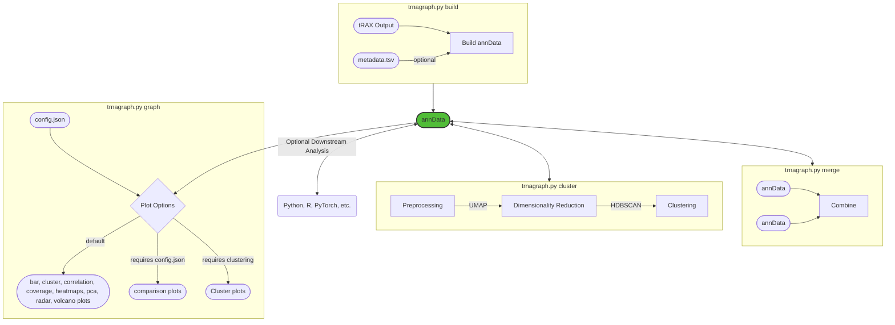

# tRNAgraph


<!-- [](https://opensource.org/licenses/MIT) -->

tRNAgraph is a tool for analyzing tRNA-seq data generated from tRAX. It can be used to create an AnnData database object from a tRAX coverage file or to analyze an existing database object and generate expanded visualizations. The database object can also be used to perform further analysis beyond the scope of what tRAX can do.

## About

[tRAX](https://github.com/UCSC-LoweLab/tRAX) is a tool often used for analyzing tRNA-seq data. While it generates a comprehensive set of results, it does not provide a way to visualize specific meta-data associated with a particular experiment. tRNAgraph is a tool that can be used to create a database object from a tRAX coverage file containing various experimental conditions not captured by tRAX. The database object can then be used to generate a variety of visualizations, including heatmaps, coverage plots, PCA plots, and more that are more specific to the experimental conditions of interest.



## Installation

Dependencies can be installed using conda:

```bash
conda env create -f environment.yml
```

## Input files

tRNAgraph will work with any tRAX (Python3 Version) generated coverage file however imputing the meta-data associated with the samples will increase the utility of the tool.

### Metadata

You will need to impute the meta-data associated with the samples if you want to generate graphs based on specific experimental conditions. To do this you can provide a whitespace/.csv/.tsv file (`-m/--metadatafile`) containing the sample names, sample groups, and any meta-data associated with the samples. If you wish to run the tool without providing a metadata file, you can instead provide the [tRAX samples file](http://trna.ucsc.edu/tRAX/#step-3-analyze-sequencing-data-for-gene-expression) used to generate your tRAX run. An example meta-data file is shown below:

```tsv
sample1 sampleGroup1 celltypeX treatmentA condition1
sample2 sampleGroup1 celltypeX treatmentA condition2
sample3 sampleGroup2 celltypeY treatmentB condition1
```

It is recommended that either a list of observations (`-l/--observationslist`) or a file containing a list of observations (`-f/--observationsfile`) be provided. The observations should match the categories found in the tRAX generation file, not including the `sample` and `group` columns. The observations can be provided in the form of a list or a file containing a list of observations. If a file is provided, each observation should be tab separated.

Example list of observations:

```tsv
celltype treatment condition
```

If no list of observations is provided then all observations will be annotated automatically `obs_#` where `#` is the ordered observation.

## Usage

### Activating the environment

```bash
conda activate trnagraph
```

### Building a database object

The tRNAgraph.py script can be used to build a database object from a tRAX directory with the following command:

```bash
python trnagraph.py build -i <tRAX_directory> -s <tRAX_samples_file> -o <output_file> -l <list_of_observations>
```

* `-i` or `--traxdir` is the path to the tRAX directory you want to build an AnnData database object from.
* `-m` or `--metadata` is the path to the tRAX generation file containing sample names, sample groups, and fastq paths.
* `-o` or `--output` is the path to the output file. The output file should be a `.h5ad` file. By default, the output file will be named `trnagraph.h5ad` if no path is provided.
* Observations are the metadata categories to include in the database object. This can be a list `-l/--observationslist` or a tab separated file containing a list of observations `-f/--observationsfile`. If no list is provided any metadata will be annotated `obs_#` where `#` is the ordered observation.
* `--log` is wether to output a log of the shell commands used to generate the AnnData object. By default, the log will not be output.

### Generating visualizations

The tRNAgraph.py script can be used to generate a variety of visualizations from a database object with the following command:

```bash
python trnagraph.py graph -i <input_database> -o <output_directory> -g <graph_type> <graph_parameters>
```

* `-i` or `--anndata` is the path to the database object you want to generate visualizations from.
* `-o` or `--output` is the path to the output directory. By default, the output directory will be named `trnagraph` if no path is provided.
* `-g` or `--graph` is the type of graph to generate. The following graphs can be generated:
  * `bar` - Generates bar plots of the tRNA coverage.
  * `cluster` - Generates cluster plots of the tRNA coverage.
  * `compare` - Generates compare plots of the tRNA coverage.
  * `correlation` - Generates correlation plots of the tRNA coverage.
  * `coverage` - Generates coverage plots.
  * `heatmap` - Generates heatmaps of the differential tRNA expression.
  * `pca` - Generates PCA plots.
  * `radar` - Generates radar plots of the tRNA coverage.
  * `volcano` - Generates volcano plots of differential tRNA expression.
  * `all` - Generates all of the above plots. Exclude `compare` and `cluster` as they require additional parameters.
* `--config` is an optional flag to the path to a JSON file containing additonal graph parameters. [See configuration section below for more details.](#configuration)
* `-n` or `--threads` is the number of threads to use for generating the graphs. By default, the number of threads will be set to 1. This is mostly useful for generating coverage plots as they can take a long time to generate.
* `--log` is wether to output a log of the shell commands used to generate the graphs. By default, the log will not be output.

The following parameters are optional and can be used to customize the graphs:

#### Compare

* `--comparegrp1` is the observation to use for grouping the compare plots. If no observation is provided, the compare plots will be grouped by sample group.
* `--comparegrp2` is the observation to use for grouping the compare plots. If no observation is provided, the compare plots will be grouped by sample group.

#### Correlation

* `--corrmethod` is the method to use for calculating the correlation. The following methods can be used:
* `pearson` - Pearson correlation coefficient.
* `spearman` - Spearman rank correlation.
* `kendall` - Kendall Tau correlation coefficient.

#### Coverage

* `--coveragegrp` is the observation to use for grouping the coverage plots. If no observation is provided, the coverage plots will be grouped by sample group.
* `--coverageobs` is the observation to use for coloring the coverage plots. If no observation is provided, the coverage plots will be colored by sample group. Multiple observations can be provided.
* `--coveragetype` is the type of tRNA coverage to plot, by default it will plot unique coverage. All posible coverage types match the [tRAX coverage types](http://trna.ucsc.edu/tRAX/outputs/#abundance-of-trna-tdrs-and-other-genes).
* `--coveragegap` is whether to include tRNA gaps in the coverage plots. By default, tRNA gaps will be skipped in the coverage plots.
* `--combineonly` is whether to only plot the combined coverage plots. By default, the coverage plots will be plotted for each individual tRNA as well as the combined coverage plots.

#### Heatmap

* `--heatgrp` is the observation to use for grouping the heatmap plots. If no observation is provided, the heatmap plots will be grouped by sample group.
* `--heatrts` is the read types to use for the heatmap plots. By default, the heatmap plots will be generated using the total unique normalized reads.
* `--heatcutoff` is the cutoff for reads to include in the heatmap plots. By default, the heatmap plots will discard anything with less than 80 reads.
* `--heatbound` is the range to bound the heatmap plots. By default, the heatmap plots will be bounded by the top 25 and the bottom 25 values in the data for each comparative column.

#### PCA

* `--pcamarkers` is the observation to use for choosing which markers to populate the pca plot. By default, the samples will be used as markers.
* `--pcacolors` is the observation to use for coloring the PCA plot. If no observation is provided, the PCA plot will be colored by samples.

#### Radar

* `--radargrp` is the observation to use for grouping the radar plots. If no observation is provided, the radar plots will be grouped by sample group.

#### Volcano

* `--volgrp` is the observation to use for grouping the volcano plots. If no observation is provided, the volcano plots will be grouped by sample group.
* `--volrt` is the read type to use for the volcano plots. By default, the volcano plots will be generated using the total unique normalized reads.
* `--volcutoff` is the cutoff for reads to include in the volcano plots. By default, the volcano plots will discard anything with less than 80 reads.

## Database Variables

The database object aggregates all the information from the tRAX directory into a single object allowing for easy calls to the data. In addition to being able to use the following variables as flags for figure generation, they can be used for further analysis and data manipulation independent of tRNAgraph.

### Observations

The observations are the metadata categories that are used to group and color the plots derived from the provided metadata. The observations are stored in the `obs` attribute of the database object as a pandas dataframe. The following observations are automatically added to the database object:

* `trna` - The tRNA name.
* `iso` - The tRNA isotype group.
* `amino` - The tRNA amino acid group.
* `sample` - The sample name from tRAX.
* `group` - The sample group tRAX.
* Any metadata categories provided in the observations list/file.
* The uniquely mapped reads are the reads that map to a single tRNA via alignment and filtering in tRAX and can be broken down into the following categories:
  * `nreads_whole_unique_raw` - The raw number of uniquely mapped whole-counts in the sample.
  * `nreads_whole_unique_norm` - The normalized number of uniquely mapped whole-counts in the sample.
  * `nreads_fiveprime_unique_raw` - The raw number of uniquely mapped 5' end counts in the sample.
  * `nreads_fiveprime_unique_norm` - The normalized number of uniquely mapped 5' end counts in the sample.
  * `nreads_threeprime_unique_raw` - The raw number of uniquely mapped 3' end counts in the sample.
  * `nreads_threeprime_unique_norm` - The normalized number of uniquely mapped 3' end counts in the sample.
  * `nreads_other_unique_raw` - The raw number of uniquely mapped other counts in the sample.
  * `nreads_other_unique_norm` - The normalized number of uniquely mapped other counts in the sample.
  * `nreads_total_unique_raw` - The raw number of uniquely mapped total counts in the sample. This is the sum of the above categories.
  * `nreads_total_unique_norm` - The normalized number of uniquely mapped total counts in the sample. This is the sum of the above categories.
* The multi-mapped reads are the reads that map via alignment but ambiguous reads are randomly assigned and can be broken down into the following categories:
  * `nreads_wholecounts_raw` - The raw number of whole-counts in the sample.
  * `nreads_wholecounts_norm` - The normalized number of whole-counts in the sample.
  * `nreads_fiveprime_raw` - The raw number of 5' end counts in the sample.
  * `nreads_fiveprime_norm` - The normalized number of 5' end counts in the sample.
  * `nreads_threeprime_raw` - The raw number of 3' end counts in the sample.
  * `nreads_threeprime_norm` - The normalized number of 3' end counts in the sample.
  * `nreads_other_raw` - The raw number of other counts in the sample.
  * `nreads_other_norm` - The normalized number of other counts in the sample.
  * `nreads_total_raw` - The raw number of total counts in the sample. This is the sum of the above categories.
  * `nreads_total_norm` - The normalized number of total counts in the sample. This is the sum of the above categories.
  * The following additional categories are also found under multi-mapped reads:
  * `nreads_wholeprecounts_raw` - The raw number of whole-precounts in the sample.
  * `nreads_wholeprecounts_norm` - The normalized number of whole-precounts in the sample.
  * `nreads_partialprecounts_raw` - The raw number of partial-precounts in the sample.
  * `nreads_partialprecounts_norm` - The normalized number of partial-precounts in the sample.
  * `nreads_trailercounts_raw` - The raw number of trailer-counts in the sample.
  * `nreads_trailercounts_norm` - The normalized number of trailer-counts in the sample.
* `fragment` - The type of fragment in the sample. This includes `fiveprime_half`, `fiveprime_fragment`, `threeprime_half`, `threeprime_fragment`, `whole`, `other_fragment`, and `multiple_fragment`.
  * The `multiple_fragment` category is used for reads that dip in the middle of reads and are not considered whole or partial reads.

### Variables

The variables are the metadata categories that are used to filter the read coverage. The variables are stored in the `var` attribute of the database object as a pandas dataframe. The following variables are automatically added to the database object:

* `gap` - Whether a position is a gap in canonical Sprinzl positions. These gaps are skipped in the coverage plots so that they can be easier to interpret when comparing different tRNAs.
* `positions` - The canonical Sprinzl positions.
* `coverage` - The coverage type matching coverage types found in the [tRAX coverage file](http://trna.ucsc.edu/tRAX/outputs/#abundance-of-trna-tdrs-and-other-genes).
* `half` - Wether the position is a 3' or 5' half position or in the center of a read.
* `location` - The portion of the tRNA relative to the sprinzl positions. This includes `fiveprime_acceptorstem`, `threeprime_acceptorstem`, `a_to_d_internal`, `dstem`, `dloop`, `d_to_anticodon_internal`, `fiveprime_anticodonstem`, `threeprime_anticodonstem`, `anticodonloop`, `anticodon_to_t_internal`, `extensionloop`, `tstem`, and `tloop`.

Since all coverage types are stored in the database object it is useful to specify which coverage type you want to use if you plan on using the database object for further analysis.

### Downstream Analysis and Filtering

Using the database object for further analysis is easy and follows the same syntax as using the AnnData object. For example, the following code will filter the database object to only include the coverage type `unique` and drop the `gap` positions:

```python
import anndata as ad

adata = ad.read_h5ad("tRNAgraph.h5ad")
adata = adata[adata.var["coverage"] == "unique"]
adata = adata[adata.var["gap"] == False]
```

If you wanted to filter the database object further to only include samples from group `A` and tRNA `tRNA-Ala-AGC-1` you could use the following code:

```python
adata = adata[adata.obs["group"] == "A"]
adata = adata[adata.obs["trna"] == "tRNA-Ala-AGC-1"]
```

The resulting table can be called using `adata.X`.

### Merge

Two database objects can be merged using the `merge` function. The following code will merge two database objects and save the result to a new database object:

```bash
python trnagraph.py merge -i1 <input_database1> -i2 <input_database2> -o <output_database> 
```

* `-i1` or `--anndata1` - The first input database object.
* `-i2` or `--anndata2` - The second input database object.
* `-o` or `--output` The output database object.
* `--dropno` - Whether to drop samples that are not found in both nontRNA_counts files. By default, samples that are not found in both nontRNA_counts files are kept and filled with zeros.
  * Different sequencing methods as well as the input GTF for tRAX can yeild vastly different results. It is recommended to use the same GTF file and sequencing method for both input files to minimize this.
* `--droprna` - Whether to drop samples that are not found in both type_counts files. By default, samples that are not found in both type_counts files are kept and filled with zeros.
  * Different sequencing methods as well as the input GTF for tRAX can yeild vastly different results. It is recommended to use the same GTF file and sequencing method for both input files to minimize this.
* `--log` is wether to output a log of the shell commands used to generate the merged AnnData object. By default, the log will not be output.

### Cluster

The database object can be clustered using the `cluster` function. The following code will cluster the database object using [UMAP](https://umap-learn.readthedocs.io/en/latest/index.html) and cluster using [HDBSCAN](https://hdbscan.readthedocs.io/en/latest/index.html). The default parameters used in tRNAgraph are found to work well on ARMseq, DM-tRNAseq, and OTTRseq data, however each dataset is different and may require fine tunnig of the parameters to yield the best results. The following code will cluster the database object and save the result to a new database object:

```bash
python trnagraph.py cluster -i <input_database> -o <output_database>
```

Clustering is perfomed across the `uniquecoverage`, `readstarts`, `readends`, `mismatchedbases`, and `deletions` categories of the annData object. When performing clustering, it is important to verify that the clustering is reproducible and the results are reflective of the data. This can be done by running the clustering multiple times and comparing the results. The clustering is also performed on `sample` and `group` observations. In the case of samples every set of reads for everysingle tRNA is used for clustering. In the case of groups, the mean of the reads is taken for each tRNA across the read categories and then used for clustering. This is done to reduce the number of samples used for clustering and to reduce the noise in the clustering. The results will be saved in the `obs` attribute of the database object as `sample_cluster\umap1\umap2` and `group_cluster\umap1\umap2` respectively. Clusters annotated as `-1` are considered noise and are not included in the clustering. Plotting of the clustering is done as well for convenience.

* `-i` or `--anndata` - The input database object.
* `-o` or `--output` - The output database object, if clustering was already performed on the input database object, the output database object will need to also be run with the `--overwrite` flag.
* `-w` or `--overwrite` - Whether to overwrite the output database object if it already contains clustering information.
* `-r` or `--randomstate` - Specify random state for UMAP if you want to have a static seed (default: None) (optional). UMAP clustering should give reproducible results regardless of random state, however you may want to use a static seed if you want to be able to reproduce the exact same results for a particular dataset. It is important to verify that the clustering is reproducible before using a static seed.
* `-t` or `--readcutoff` - Specify readcount cutoff to use for clustering (default: 15) (optional). This is the minimum number of reads required for a tRNA to be included in the clustering. This is useful for removing tRNAs that are not expressed in the dataset as they can skew the clustering.
* `-c1` or `--ncomponentsmp` - Specify number of components to use for UMAP clustering of samples (default: 2) (optional). This is the number of components to use for the UMAP clustering of the samples. Since this is independent of the number of components used for the UMAP plotting you can use a higher number of components for clustering to get better results. This will need to be tuned for each dataset and depends on the variability of the dataset.
* `-c2` or `--ncomponentgrp` - Specify number of components to use for UMAP clustering of groups (default: 2) (optional). See above.
* `-l1` or `--neighborclusmp` - Specify number of neighbors to use for UMAP clustering of samples (default: 150) (optional). This is the number of neighbors to use for the UMAP clustering of the samples. This will need to be tuned for each dataset and depends on the variability of the dataset. In general, a higher number of neighbors will yeild a wider dispersion of the clusters across the projection.
* `-l2` or `--neighborclusgrp` - Specify number of neighbors to use for UMAP clustering of groups (default: 40) (optional). See above.
* `-n1` or `--neighborstdsmp` - Specify number of neighbors to use for UMAP projection plotting of samples (default: 75) (optional). See above.
* `-n2` or `--neighborstdgrp` - Specify number of neighbors to use for UMAP projection plotting of groups (default: 20) (optional). See above.
* `-d1` or `--hdbscanminsampsmp` - Specify minsamples size to use for HDBSCAN clustering of samples (default: 5) (optional). This is the minimum number of samples required for a cluster to be considered a cluster.
* `-d2` or `--hdbscanminsampgrp` - Specify minsamples size to use for HDBSCAN clustering of groups (default: 3) (optional). See above.
* `-b1` or `--hdbscanminclusmp` - Specify min cluster size to use for HDBSCAN clustering of samples (default: 30) (optional). This is the minimum number of samples required for a cluster to be considered a cluster.
* `-b2` or `--hdbscanminclugrp` - Specify min cluster size to use for HDBSCAN clustering of groups (default: 10) (optional). See above.
* `--log` is wether to output a log of the shell commands used to generate the clustered AnnData object. By default, the log will not be output.

### Configuration

A JSON file can be used for complicated filtering and grouping of the data as well as using custom colormaps. Any of these categories can be left blank and they will be skipped.

* `name` - Is a name for the filtering configuration and will be saved as a subfolder in the output directory.
* `obs` and `var` -  Are conditions to filter on in the AnnData observation and variable categories respectively. The values can be a single value or a list of values. If a list of values is provided, the data will be filtered to include only the values in the list. If no values are provided, the data will not be filtered on that category.
* `colormap` - It is a dictionary of dictionaries that allows custom colormaps to be used for the observations. The first level of the dictionary is the observation category, and the second level is the value of color. The value can be a hex color code or an RGB tuple value. If no colormap is provided, the default colormap will be used. The colormap will only be used if the observation for the colormap is selected, generating the plot. For example, if coverage plots are being generated, the colormap will only be used if the `--coveragegrp` flag matches an existing colormap. The JSON file should be formatted as follows:
  * `group` - Some plots default to using this category for ploting making a colormap with this name will override the default colormap in those cases.

```json
{
    "name": "name",
    "obs": {
        "observation_1": ["value1", "value2"],
        "observation_2": ["value1"]
    },
    "var": {
        "variable_1": ["value1", "value2"]
    },
    "colormap": {
        "observation_1": {
            "value1": "#000000",
            "value2": "#FFFFFF"
        }
    }
}
```
