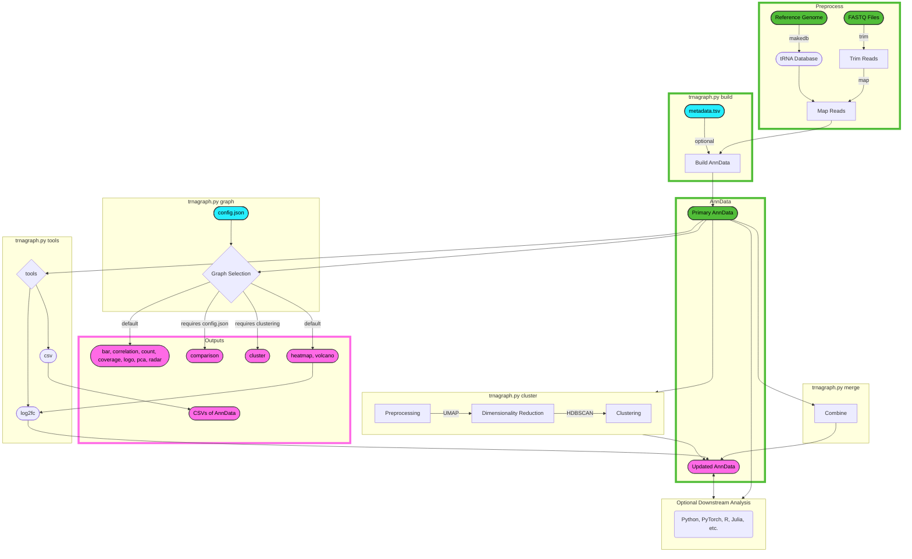

# tRNAgraph


[](https://www.gnu.org/licenses/gpl-3.0)
[](https://doi.org/10.5281/zenodo.14669314)

tRNAgraph is a tool for analyzing tRNA-seq data generated from tRAX. It can be used to create an [AnnData](https://anndata.readthedocs.io/en/latest/index.html) object from a tRAX coverage file or to analyze an existing database object and generate expanded visualizations. The database object can also be used to perform further analysis beyond the scope of what tRAX can do.

## About

[tRAX](https://github.com/UCSC-LoweLab/tRAX) is a tool often used for analyzing tRNA-seq data. While it generates a comprehensive set of results, it does not provide a way to visualize specific meta-data associated with a particular experiment. tRNAgraph is a tool that can be used to create a database object from a tRAX coverage file containing various experimental conditions not captured by tRAX. The database object can then be used to generate a variety of visualizations, including heatmaps, coverage plots, PCA plots, and more that are more specific to the experimental conditions of interest.


```mermaid
    %%{ init: { 'flowchart': { 'curve': 'basis' } } }%%
    flowchart TD
      subgraph sg0 [Preprocess]
        F([FASTQ Files]) -->|trim| P1[Trim Reads]
        P1 -->|map| P2[Map Reads]
        R([Reference Genome]) -->|makedb| D([tRNA Database])
        D --> P2
      end
      subgraph sg1 [trnagraph.py build]
        P2 --> B[Build AnnData]
        M([metadata.tsv]) -->|optional| B
      end
      B --> I2
      subgraph O [Outputs]
        G1
        G2
        G3
        G4
        D1([CSVs of AnnData])
      end
      subgraph sgI1 [AnnData]
        I2([Primary AnnData])
        I2.2([Updated AnnData])
      end
      I2 --> sg3
      subgraph sg3 [trnagraph.py cluster]
        C1[Preprocessing] -->|UMAP| C2[Dimensionality Reduction] -->|HDBSCAN| C3[Clustering]
      end
      sg3 --> I2.2
      I2 --> C
      subgraph sg4 [trnagraph.py merge]
        C[Combine]
      end
      C --> I2.2
      I2 --> G{Graph Selection}
      subgraph sg5 [trnagraph.py tools]
        T --> L([log2fc])
        T --> D2([csv]) --> D1
      end
      I2 --> T{tools}
      subgraph sg2 [trnagraph.py graph]
        G -->|default| G1([bar, correlation, count, coverage, logo, pca, radar])
        G -->|default| G4([heatmap, volcano]) --> L([log2fc]) --> I2.2
        G -->|requires config.json| G2([comparison])
        G -->|requires clustering| G3([cluster])
        J([config.json]) --> G
      end
      subgraph sg1.2 [Optional Downstream Analysis]
        direction LR
        R1(Python, PyTorch, R, Julia, etc.)
      end
      I2 --> sg1.2
      I2.2 <--> sg1.2
      style F fill:#51BD38,stroke:#333,stroke-width:2px,color:#000000
      style R fill:#51BD38,stroke:#333,stroke-width:2px,color:#000000
      style M fill:#25EEFF,stroke:#333,stroke-width:2px,color:#000000
      style J fill:#25EEFF,stroke:#333,stroke-width:2px,color:#000000
      style D1 fill:#FF6AE6,stroke:#333,color:#000000
      style G1 fill:#FF6AE6,stroke:#333,color:#000000
      style G2 fill:#FF6AE6,stroke:#333,color:#000000
      style G3 fill:#FF6AE6,stroke:#333,color:#000000
      style G4 fill:#FF6AE6,stroke:#333,color:#000000
      style I2 fill:#51BD38,stroke:#333,stroke-width:2px,color:#000000
      style I2.2 fill:#FF6AE6,stroke:#333,color:#000000
      style O stroke:#FF6AE6,stroke-width:6px
      style sg1 stroke:#51BD38,stroke-width:6px
      style sgI1 stroke:#51BD38,stroke-width:6px
      style sg0 stroke:#51BD38,stroke-width:6px
```

$\color{#51BD38}{\textsf{Primary Inputs}}$ - $\color{#25EEFF}{\textsf{Optional Inputs}}$ - $\color{#FF6AE6}{\textsf{Outputs}}$

## Installation

Dependencies can be installed using conda:

```bash
conda env create -f env/requirements.yaml
```

or update an existing environment with:

```bash
conda env update -f env/requirements.yaml
```

## Usage

### Activating the environment

```bash
conda activate tRNAgraph
```

tRNAgraph can be used with `preprocess`, `build`, `cluster`, `merge`, `graph` and `tools` commands. The `preprocess` command is used to run the tRAX pipeline steps (trim, makedb, map). The `build` command generates an AnnData object from a tRAX coverage file. The `graph` command creates visualizations from the database object. The `cluster` command is used to cluster the database object. The `merge` command is used to merge two database objects. The following sections will describe how to use each command.

### Preprocess

The `preprocess` command integrates an updated tRAX pipeline directly into tRNAgraph.

> [!TIP]
> For a complete list of all flags and options, see [docs/flags.md](docs/flags.md).

#### MakeDB

Creates a Bowtie2 index for the tRNA database.

```bash
python trnagraph.py preprocess makedb -g <genome> -t <trnascan> -r <gtrnafa> -m <namemap> [options]
```

| Flag              | Description                                            |
| :---------------- | :----------------------------------------------------- |
| `-g`, `--genome`  | Genome FASTA file.                                     |
| `-t`, `--trnaout` | tRNAscan-SE output file.                               |
| `-r`, `--trnafa`  | gtRNAdb FASTA file.                                    |
| `-m`, `--namemap` | Name map file.                                         |
| `-s`, `--orgmode` | Organism mode (`euk`, `bact`, `arch`). Default: `euk`. |
| `-o`, `--output`  | Output prefix (default: `db`).                         |

#### Trim

Trims adapters from FASTQ files using `fastp`.

```bash
python trnagraph.py preprocess trim -n <name> -i <manifest> [options]
```

| Flag                | Description                                                     |
| :------------------ | :-------------------------------------------------------------- |
| `-n`, `--name`      | Name of the run (used for output filenames).                    |
| `-i`, `--manifest`  | Tab-delimited file: `SampleName <tab> R1_Path [<tab> R2_Path]`. |
| `-a1`, `--adapter1` | Adapter sequence for R1 (optional).                             |
| `-a2`, `--adapter2` | Adapter sequence for R2 (optional).                             |
| `-t`, `--threads`   | Total number of threads to use.                                 |

#### Map

Maps reads to the tRNA database and generates coverage files.

```bash
python trnagraph.py preprocess map -n <name> -d <database> -s <samples> [options]
```

| Flag               | Description                      |
| :----------------- | :------------------------------- |
| `-n`, `--name`     | Experiment name.                 |
| `-d`, `--database` | Name of the tRNA database.       |
| `-s`, `--samples`  | Sample file.                     |
| `-t`, `--threads`  | Number of threads to use.        |
| `--bamdir`         | Directory for placing bam files. |

### Build

The tRNAgraph.py script can be used to build a database object from a `preprocess map` output directory.

```bash
python trnagraph.py build -i <metadata> -o <output_directory> -d <database>
```

| Flag                          | Description                                     |
| :---------------------------- | :---------------------------------------------- |
| `-i`, `--input`, `--metadata` | Path to the metadata file.                      |
| `-o`, `--output`              | Path to the output directory (default: `h5ad`). |
| `-d`, `--database`            | Name of the tRNA database.                      |

### Cluster

The database object can be clustered using the `cluster` function.

```bash
python trnagraph.py cluster -i <input_database> -o <output_database>
```

| Flag                | Description                             |
| :------------------ | :-------------------------------------- |
| `-i`, `--anndata`   | Input database object.                  |
| `-o`, `--output`    | Output database object.                 |
| `-w`, `--overwrite` | Overwrite existing cluster information. |

### Merge

Two database objects can be merged using the `merge` function.

```bash
python trnagraph.py merge -i1 <input_database1> -i2 <input_database2> -o <output_database>
```

| Flag                | Description                   |
| :------------------ | :---------------------------- |
| `-i1`, `--anndata1` | First input database object.  |
| `-i2`, `--anndata2` | Second input database object. |
| `-o`, `--output`    | Output database object.       |

### Graph

The tRNAgraph.py script can be used to generate a variety of visualizations.

```bash
python trnagraph.py graph -i <input_database> -o <output_directory> -g <graph_type>
```

| Flag              | Description                                                       |
| :---------------- | :---------------------------------------------------------------- |
| `-i`, `--anndata` | Input database object.                                            |
| `-o`, `--output`  | Output directory (default: `figures`).                            |
| `-g`, `--graph`   | Type of graph to generate (e.g., `bar`, `heatmap`, `pca`, `all`). |

### Tools

The `tools` function can be used to perform various operations on the database object.

- `log2fc` - Calculate log2 fold change.
- `csv` - Export to CSV.

## Downstream Analysis and Filtering

Using the database object for further analysis is easy and follows the same syntax as using the AnnData object. For example, the following code will filter the database object to only include the coverage type `unique` and drop the `gap` positions:

```python
import anndata as ad

adata = ad.read_h5ad("tRNAgraph.h5ad")
adata = adata[adata.var["coverage"] == "unique"]
adata = adata[adata.var["gap"] == False]
```

If you wanted to filter the database object further only to include samples from group `A` and tRNA `tRNA-Ala-AGC-1` you could use the following code:

```python
adata = adata[adata.obs["group"] == "A"]
adata = adata[adata.obs["trna"] == "tRNA-Ala-AGC-1"]
```

The resulting table can be called using `adata.X`.

### Configuration Files

JSON files can be used for complicated filtering and grouping of the data as well as using custom colormaps. If a `config.json` is provided with the `--config` flag a `name` for filtering and output must be provided.

- `name` - This is a name for the filtering configuration and will be saved as a subfolder in the output directory.
- `obs` and `var` - Are conditions to filter on in the AnnData observation and variable categories, respectively. The values can be a single value or a list of values. If a list of values is provided, the data will be filtered to include only those in the list. The data will not be filtered on that category if no values are provided.
  - `obs_r` and `var_r` - Can also be used to filter the data to exclude the values in the list, rather than include them. This is useful if you want to exclude tRNA pseudogenes, for example.

```json
{
  "name": "name",
  "obs": {
    "treatment": ["treatment 1"],
    "celltype": ["HEK293"],
    "pseudogene": ["tRNA"]
  },
  "obs_r": {
    "amino": ["Und"]
  },
  "var": {
    "variable_1": ["value1", "value2"]
  }
}
```

A custom `colormap.json` can also be provided with the `--colormap` flag. The values can be a hex color code, RGB tuple value, or [matplotlib color names](https://matplotlib.org/stable/gallery/color/named_colors.html). If no colormap is provided, the default colormap will be used. The colormap will only be used if the observation for the colormap is selected, generating the plot. For example, if coverage plots are generated, the colormap will only be used if the `--coveragegrp` flag matches an existing colormap. The JSON file should be formatted as follows:

```json
{
  "group": {
    "A": "lightskyblue",
    "B": "deepskyblue",
    "C": "royalblue"
  },
  "amino": {
    "Ala": "#1F77B4",
    "Arg": "#AEC7E8",
    "Asn": "#FF7F0E",
    "Asp": "#FFBB78",
    "Cys": "#6fe835",
    "Gln": "#d0f2cb",
    "Glu": "#D62728",
    "Gly": "#FF9896",
    "His": "#9258f5",
    "Ile": "#deccfc",
    "Leu": "#a65223",
    "Lys": "#ffceb3",
    "iMet": "#00d5e3",
    "Met": "#b8fbff",
    "Phe": "#edd500",
    "Pro": "#ffff99",
    "Ser": "#db56bc",
    "Thr": "#F7B6D2",
    "Trp": "#2CA02C",
    "Tyr": "#98DF8A",
    "Val": "#6a3d9a",
    "SeC": "#C5B0D5",
    "Sup": "#808080"
  },
  "obs_etc": {
    "value1": "#1F77B4",
    "value2": "#FF7F0E"
  }
}
```

Some plots default to using `group` as the default category for plotting making a colormap with this name will override the default colormap in those cases.

## Database Variables

The database object aggregates all the information from the tRAX directory into a single object, allowing easy calls to the data. In addition to using the following variables as flags for figure generation, they can be used for further analysis and data manipulation independent of tRNAgraph.

### Observations

The observations are the metadata categories used to group and color the plots derived from the provided metadata. The observations are stored in the `obs` attribute of the database object as a pandas data frame. The following observations are automatically added to the database object:

- `trna` - The tRNA name.
- `iso` - The tRNA isotype group.
- `amino` - The tRNA amino acid group.
- `sample` - The sample name from tRAX.
- `group` - The sample group tRAX.
- `pseudogene` - Whether the tRNA is a pseudogene (tRNA/tRX).
- `deseq2_sizefactor` - The size factor used for normalization in DESeq2 for the sample.
- `refseq` - The reference sequence aligned with Sprinzl positions. This subset will drop any gap, extension, or alternate positions. (1-76) <!-- Need to check if this is static in all cases -->
- `refseq_full` - The reference sequence aligned with sprinzl positions.
- `dataset` - The name of the output file (Useful for combining multiple datasets if the merge function is used)
- Any metadata categories provided in the observations list/file.
- The uniquely mapped reads are the reads that map to a single tRNA via alignment and filtering in tRAX and can be broken down into the following categories:
  - `nreads_whole_unique_raw` - The raw number of uniquely mapped whole-counts in the sample.
  - `nreads_whole_unique_norm` - The sample's normalized number of uniquely mapped whole-counts.
  - `nreads_fiveprime_unique_raw` - The sample's raw number of uniquely mapped 5' end-counts.
  - `nreads_fiveprime_unique_norm` - The sample's normalized number of uniquely mapped 5' end-counts.
  - `nreads_threeprime_unique_raw` - The sample's raw number of uniquely mapped 3' end-counts.
  - `nreads_threeprime_unique_norm` - The sample's normalized number of uniquely mapped 3' end-counts.
  - `nreads_other_unique_raw` - The sample’s raw number of uniquely mapped other-counts.
  - `nreads_other_unique_norm` - The sample’s normalized number of uniquely mapped other-counts.
  - `nreads_total_unique_raw` - The sample's raw number of uniquely mapped total-counts. This is the sum of the above categories.
  - `nreads_total_unique_norm` - The sample's normalized number of uniquely mapped total-counts. This is the sum of the above categories.
- The multi-mapped reads map via alignment, but ambiguous reads are randomly assigned and can be broken down into the following categories:
  - `nreads_wholecounts_raw` - The sample’s raw number of whole-counts.
  - `nreads_wholecounts_norm` - The sample’s normalized number of whole-counts.
  - `nreads_fiveprime_raw` - The sample’s raw number of 5' end-counts.
  - `nreads_fiveprime_norm` - The sample's normalized number of 5' end-counts.
  - `nreads_threeprime_raw` - The sample’s raw number of 3' end-counts.
  - `nreads_threeprime_norm` - The sample's normalized number of 3' end-counts.
  - `nreads_other_raw` - The sample's raw number of other-counts.
  - `nreads_other_norm` - The sample's normalized number of other-counts.
  - `nreads_total_raw` - The sample's raw number of total-counts. This is the sum of the above categories.
  - `nreads_total_norm` - The sample’ normalized number of total-counts. This is the sum of the above categories.
  - The following additional categories are also found under multi-mapped reads:
  - `nreads_wholeprecounts_raw` - The raw number of whole-precounts in the sample.
  - `nreads_wholeprecounts_norm` - The normalized number of whole-precounts in the sample.
  - `nreads_partialprecounts_raw` - The raw number of partial-precounts in the sample.
  - `nreads_partialprecounts_norm` - The normalized number of partial-precounts in the sample.
  - `nreads_trailercounts_raw` - The raw number of trailer-counts in the sample.
  - `nreads_trailercounts_norm` - The normalized number of trailer-counts in the sample.
- `fragment` - The type of fragment in the sample. This includes `fiveprime_half`, `fiveprime_fragment`, `threeprime_half`, `threeprime_fragment`, `whole`, `other_fragment`, and `multiple_fragment`.
  - The `multiple_fragment` category is used for reads that dip in the middle of reads and are not considered whole- or partial-reads.

**Caution:** The `other` category types are comprised of 'antisense', 'wholeprecounts', 'partialprecounts', and 'trailercounts' found via tRAX alignment and are highly dependent on the sequencing method.

### Input files

tRNAgraph works with the output of the `preprocess` pipeline and a metadata file.

#### Metadata

You must attribute the meta-data associated with the samples if you want to generate graphs based on specific experimental conditions. To do this, you can provide a .tsv/.csv file (`-m/--metadatafile`) containing the sample names, sample groups, and any meta-data associated with the samples. This file must also include a header row with, at minimum, `sample` and `group` columns. The meta-data file can contain any number of additional columns corresponding to the experimental conditions you want to visualize. An example meta-data file is shown below:

```tsv
sample  group celltype  treatment condition
sample1 sampleGroup1 celltypeX treatmentA condition1
sample2 sampleGroup1 celltypeX treatmentA condition2
sample3 sampleGroup2 celltypeY treatmentB condition1
```

- If you wish to run the tool without providing any metadata, you can instead provide the samples file used to generate your run and add the header row to the top of the file. The samples file should contain the `sample group fastq` columns.
- If no header column for each observations is provided, then all observations will be annotated automatically as `obs_#` where `#` is the ordered observation.

### Variables

The variables are the metadata categories used to filter the read coverage. The variables are stored in the `var` attribute of the database object as a pandas data frame. The following variables are automatically added to the database object:

- `gap` - Whether a position is a gap in canonical Sprinzl positions. These gaps are skipped in the coverage plots so they can be easier to interpret when comparing different tRNAs.
- `positions` - The canonical Sprinzl positions.
  - `adenines`, `cytosines`, `guanines`, `thymines`, and `deletions` are raw values in tRAX, while the rest are normalized values. To simplify, these are converted to normalized values by dividing by the Desq2 size factor. You can access the raw values using `adata.layers["raw"]` instead of `adata.X`.
- `coverage` - The coverage type matching coverage types found in the [tRAX coverage file](http://trna.ucsc.edu/tRAX/outputs/#abundance-of-trna-tdrs-and-other-genes).
- `half` - Whether the position is a 3' or 5' half position or in the center of a read.
- `location` - The portion of the tRNA relative to the sprinzl positions. This includes `fiveprime_acceptorstem`, `threeprime_acceptorstem`, `a_to_d_internal`, `dstem`, `dloop`, `d_to_anticodon_internal`, `fiveprime_anticodonstem`, `threeprime_anticodonstem`, `anticodonloop`, `anticodon_to_t_internal`, `extensionloop`, `tstem`, and `tloop`.

Since all coverage types are stored in the database object, it is useful to specify which coverage type you want to use if you use it for further analysis.

### Layers

By default, all values in the database object (`adata.X`) are normalized using the DESeq2 size factor. The layers feature of AnnData is used to store the raw data from the coverage file for convenience. To access the raw data, you can use `adata.layers["raw"]` instead of `adata.X`.

### Uns

The uns attribute of the database object is used to store information that is not directly aligned with the observations and variables and other metadata. The following uns categories are automatically added to the database object:

- `amino_counts` - The amino acid counts for the tRNAs from the tRAX output directory.
- `anticodon_counts` - The anticodon counts for the tRNAs from the tRAX output directory.
- `nontRNA_counts` - The non-tRNA counts for the tRNAs from the tRAX output directory, this is based on the GTF file used for tRAX.
- `type_counts` - The tRNA type counts for the tRNAs from the tRAX output directory.
- `cluster_runinfo` - The information from the clustering run if it was performed.
- `group_cluster_umap` - The UMAP coordinates for the group clustering if it was performed.
- `sample_cluster_umap` - The UMAP coordinates for the sample clustering if it was performed.
- `log2FC` - The log2 fold change for the differential tRNA expression saved as a dictionary of dataframes.
  - This is automatically calculated for `nreads_total_unique_norm` and `nreads_total_norm` for between groups with common read-cutoffs.
- `traxruninfo` - The information from the tRAX run is based on the runinfo file.
- `trnagraphruninfo` - The information from the tRNAgraph when the database object was generated.

## Testing

A test suite is included with tRNAgraph to ensure that the code is functioning correctly. This tool will download test data, preprocess it, and run it through the tRNAgraph pipeline to ensure that everything is working correctly. The test suite can be found in the `toolsTestSuite.py` file.

To run the test suite, you can use the following command:

```bash
python trnagraph.py tools test
```

More information about the test suite can be found in [docs/testSuite.md](docs/testSuite.md).

## License

tRNAgraph is licensed under the [GNU GPLv3](https://www.gnu.org/licenses/gpl-3.0.en.html) license.
