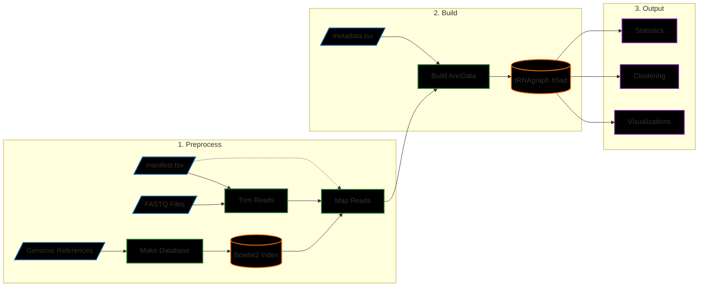

# tRNAgraph


[](https://www.gnu.org/licenses/gpl-3.0)
[](https://doi.org/10.5281/zenodo.14669314)

tRNAgraph is a comprehensive toolkit for analyzing tRNA-seq data. Built upon the foundation of [tRAX](https://github.com/UCSC-LoweLab/tRAX), it generates [AnnData](https://anndata.readthedocs.io/en/latest/index.html) objects, allowing for high-dimensional visualization, clustering, and differential expression analysis.

## Overview

tRNAgraph bridges the gap between raw alignment data and biological insight. It allows users to:

1. **Preprocess** raw FASTQ files (Trim, Map, Index).
2. **Build** a structured database (AnnData) containing experimental metadata.
3. **Analyze** data via clustering (UMAP, HDBSCAN) and differential expression.
4. **Visualize** results using a suite of built-in graphing tools (Heatmaps, PCA, Coverage Plots, etc.).


```mermaid
flowchart LR
  %% Input Nodes
  I1[/"manifest.tsv"/]
  I2[/"FASTQ Files"/]
  I3[/"Genomic References"/]
  I4[/"metadata.tsv"/]

  %% Processing Nodes
  P1[Trim Reads]
  P2[Make Database]
  P3[Map Reads]
  B1[Build AnnData]

  %% Data/Storage Nodes
  D1[("Bowtie2 Index")]
  D2[("tRNAgraph.h5ad")]

  %% Output Nodes
  O1[Visualizations]
  O2[Clustering]
  O3[Statistics]

  %% Flow
  subgraph Step1 [1. Preprocess]
    direction TB
    I3 --> P2 --> D1
    I2 & I1 --> P1
    P1 & D1 --> P3
    I1 -.-> P3
  end

  subgraph Step2 [2. Build]
    P3 --> B1
    I4 --> B1
    B1 --> D2
  end

  subgraph Step3 [3. Output]
    D2 --> O1
    D2 --> O2
    D2 --> O3
  end

  %% Styling
  classDef input fill:#000000,stroke:#01579b,stroke-width:2px;
  classDef process fill:#000000,stroke:#2e7d32,stroke-width:2px;
  classDef storage fill:#000000,stroke:#ef6c00,stroke-width:2px;
  classDef output fill:#000000,stroke:#7b1fa2,stroke-width:2px;

  class I1,I2,I3,I4 input;
  class P1,P2,P3,B1 process;
  class D1,D2 storage;
  class O1,O2,O3 output;
```

## Documentation

- **[Installation & Quick Start](#installation)**: Get up and running.
- **[CLI Reference](docs/cli_reference.md)**: Detailed documentation for all commands and flags.
- **[Data Structure](docs/data_structure.md)**: Details on the AnnData object, observations, and variables.
- **[Advanced Usage](docs/advanced_usage.md)**: Python API, configuration files, and downstream analysis.
- **[Test Suite](docs/testSuite.md)**: How to run the automated validation pipeline.
- **[Roadmap](docs/roadmap.md)**: Future features and planned improvements.

## Installation

Dependencies can be installed using conda/mamba, and the package itself is installed via pip:

```bash
# 1. Create the environment with non-Python dependencies (bowtie2, etc.)
conda env create -f requirements.yaml
conda activate tRNAgraph

# 2. Install tRNAgraph in editable mode
pip install -e .
```

## Quick Start

### 1. Prepare Inputs

You need two tab-delimited files to begin:

**manifest.tsv** (For trimming and mapping):
_Format: SampleName `<tab>` R1_Path `<tab>` R2_Path (optional)_

> [!NOTE]
> If single-end reads are used, only provide the R1 column.

```text
SampleA   raw_data/SampleA_R1.fastq.gz   raw_data/SampleA_R2.fastq.gz
SampleB   raw_data/SampleB_R1.fastq.gz   raw_data/SampleB_R2.fastq.gz
```

**metadata.tsv** (For building the database):
_Format: Must contain `sample` and `group` columns. Add other columns as needed._

> [!TIP]
> More metadata columns allow for richer analysis and visualization.

```text
sample    group     treatment
SampleA   Control   None
SampleB   Treated   DrugX
```

### 2. Preprocess Data

Run the integrated wrapper for trimming (fastp), tRNA database generation (bowtie2), mapping (bowtie2):

```bash
# Create database
trnagraph preprocess makedb -g genome.fa -t trnascan.out -r gtrna.fa -m namemap.txt

# Trim reads
trnagraph preprocess trim -i manifest.txt -o output

# Map reads
trnagraph preprocess map -i manifest.txt -d database -o output
```

### 3. Build Database

Convert coverage files into a tRNAgraph AnnData object, attaching your metadata:

```bash
trnagraph build -i metadata.tsv -o results_dir -d db_name
```

### 4. Generate Graphs

Create a standard suite of visualizations:

```bash
trnagraph graph -i results_dir/data.h5ad -o figures -g all
```

## Output Structure

A standard run of the full pipeline will generate the following directory structure with default settings:

```text
project_root/
├── db/                              # Generated by 'preprocess makedb' (Default: db/)
│   ├── database.1.bt2
│   ├── database.fa
│   └── ...
├── processed/                       # Generated by 'preprocess'
│   ├── trimmed/                     # Generated by 'trim' (Default: processed/trimmed)
│   │   ├── SampleA_trimmed.fq.gz
│   │   ├── ...
│   │   ├── trim_feature_types.pdf   # Example QC plot
│   │   └── trim_stats.csv
|   |
│   └── output_bam/                  # Generated by 'map' (Default: processed/<experiment_name>_bam)
│       ├── SampleA.bam
│       └── ...
├── results/                         # Generated by 'build'
│   ├── data.h5ad                    # The main AnnData database object
│   └── run_info.json                # Metadata about the build process
└── graphs/                          # Generated by 'graph'
    ├── bar/                         # Read count bar charts
    ├── cluster/                     # UMAP/HDBSCAN plots
    ├── coverage/                    # Coverage profiles per tRNA
    ├── heatmap/                     # Differential expression heatmaps
    ├── pca/                         # PCA plots
    ├── volcano/                     # Volcano plots for DE
    └── ...
```

## License

tRNAgraph is licensed under the [GNU GPLv3](https://www.gnu.org/licenses/gpl-3.0.en.html) license.
