# Advanced Usage and Configuration

## Workflow Overview

The following diagram illustrates the comprehensive workflow of tRNAgraph, detailing the flow of data from raw inputs through preprocessing, analysis, and visualization.

```mermaid
graph TD
    %% Classes
    classDef input fill:#000000,stroke:#01579b,stroke-width:2px;
    classDef process fill:#000000,stroke:#2e7d32,stroke-width:2px;
    classDef storage fill:#000000,stroke:#ef6c00,stroke-width:2px;
    classDef output fill:#000000,stroke:#7b1fa2,stroke-width:2px;

    subgraph Inputs
        M[Manifest File]
        MD[Metadata File]
        FQ[FASTQ Files]
        G[Genome FASTA]
        T[tRNA Scan Output]
    end

    subgraph Preprocess
        DB[makedb]
        TR[trim]
        MP[map]

        G & T --> DB
        FQ & M --> TR
    end

    IDX[("Bowtie2 index\n&lt;output&gt;.*.bt2")]
    TRIMMED[("Trimmed reads\nprocessed/trimmed/")]
    DB --> IDX --> MP
    TR --> TRIMMED --> MP

    BAMDIR[("BAM directory\nprocessed/&lt;name&gt;/bam/")]
    MP --> BAMDIR

    subgraph Analyze
        B["build\n(--readlengthsplit: split reads by\nlength internally, temp BAMs)"]
        AS["addsplit\n(adds another split cutoff)"]
        C["cluster\n(adds UMAP/HDBSCAN labels)"]
    end

    BAMDIR & MD --> B
    ADATA[("AnnData object\n&lt;out_dir&gt;/&lt;name&gt;.h5ad")]
    RESULTS[("Results directory\n&lt;out_dir&gt;/results/, graphs/\n(+ results_&lt;tag&gt;/graphs_&lt;tag&gt; per split)")]
    B -->|creates| ADATA
    B -->|creates| RESULTS
    AS -.->|updates in place| ADATA
    AS -.->|adds results_&lt;tag&gt;/graphs_&lt;tag&gt;| RESULTS
    C -.->|updates in place| ADATA

    subgraph Tools
        L2FC[log2fc]
        CSV[csv]
        MG["merge\n(combines two objects)"]
    end
    L2FC -.->|updates in place| ADATA
    ADATA --> CSV --> CSVO[("CSV directory")]
    ADATA -->|one of two inputs| MG -->|new file| MERGED[("Merged .h5ad")]

    subgraph Graph
        V[graph]
    end
    ADATA --> V --> FIG[("Figures directory\nPDF / PNG")]

    %% Apply Classes
    class M,MD,FQ,G,T input;
    class DB,TR,MP,B,AS,C,MG,L2FC,CSV,V process;
    class IDX,TRIMMED,BAMDIR,ADATA,RESULTS,MERGED storage;
    class FIG,CSVO output;
```



> [!NOTE]
> `addsplit`, `cluster`, and `log2fc` all take an existing `.h5ad` as input (`-i`/`--anndata`) and, by default, write their result back into that same object — the dashed arrows above represent that in-place update, not a new file. `cluster` and `addsplit` accept `-o`/`--output` to write to a new path instead if you don't want to modify the original.
>
> Read-length splitting (`build --readlengthsplit` / `analyze addsplit`) works by splitting the mapped BAMs into `u<N>`/`o<N>` subsets, running the analysis pipeline on each, and merging the result into the AnnData object as `_<tag>`-suffixed layers/obsm/uns entries — no separate `_uN.h5ad`/`_oN.h5ad` files are produced. The intermediate `u<N>`/`o<N>` BAM files are scratch files deleted once that merge completes; pass `--savesplitbams` to keep them on disk instead.

## Workflow Steps

### 1. Preprocess

The preprocessing module handles raw data preparation.

- **[makedb](cli_reference.md#makedb)**: Creates a Bowtie2 index from a reference genome and tRNA predictions.
- **[trim](cli_reference.md#trim)**: Uses `fastp` to remove adapters and process UMIs from raw FASTQ files.
- **[map](cli_reference.md#map)**: Aligns trimmed reads to the tRNA database using Bowtie2.

### 2. Analyze

The analysis module builds and refines the core database.

- **[build](cli_reference.md#build)**: Aggregates alignment data (BAMs) and metadata into a structured AnnData object (`.h5ad`). Optionally adds an initial read-length split variant via `--readlengthsplit` (e.g., <60bp and >=60bp), which internally splits BAMs by read length, analyzes each subset, and discards the intermediate split BAM files afterward unless `--savesplitbams` is passed.
- **[addsplit](cli_reference.md#addsplit)**: Adds a further read-length split variant to an existing AnnData object, alongside any already present. Uses the same internal split-then-discard BAM handling as `build --readlengthsplit`.
- **[cluster](cli_reference.md#cluster)**: Performs dimensionality reduction (UMAP) and density-based clustering (HDBSCAN) on the dataset.

### 3. Graph

- **[graph](cli_reference.md#graph)**: Generates a comprehensive suite of visualizations (Heatmaps, PCA, Coverage Plots, etc.) from the AnnData object.

### 4. Tools

Utility functions for specific data operations.

- **[log2fc](cli_reference.md#log2fc)**: Calculates Log2 Fold Change statistics for differential expression analysis.
- **[csv](cli_reference.md#csv)**: Exports the internal data structures (obs, var, X) to CSV format for external use.
- **[merge](cli_reference.md#merge)**: Combines two existing AnnData objects into a single dataset.
- **[test](testSuite.md)**: Runs the test suite to validate installation and functionality.

## Configuration Files

You can control filtering and coloring in `trnagraph graph` using JSON files.

### Filter Configuration (`--config`)

Used to filter data before plotting.

```json
{
  "name": "analysis_subset",
  "obs": {
    "treatment": ["treatment_A"],
    "celltype": ["HEK293"]
  },
  "obs_r": {
    "amino": ["Und", "Sup"]
  },
  "var": {
    "coverage": ["unique"]
  }
}
```

- `name`: Name for the filtering configuration. Will be used to create a subfolder in the output directory.
- `obs`: Include only these values.
- `obs_r`: **Reverse** filter (Exclude these values).

### Custom Colormaps (`--colormap`)

Define custom colors for groups or features. Supports Hex, RGB, or Matplotlib names.

```json
{
  "group": {
    "Control": "lightgrey",
    "Treated": "#FF5733"
  },
  "amino": {
    "Ala": "royalblue",
    "Gly": "#FF9896"
  },
  "trimtype": {
    "Merged": "royalblue",
    "Unmerged": "lightgrey",
    "Trimmed": "royalblue",
    "Discarded": "#B0B0B0"
  }
}
```

> [!NOTE]
> Some plots default to using group as the default category for plotting making a colormap with this name will override the default colormap in those cases.

> [!NOTE]
> `preprocess trim --colormap` runs before any AnnData object exists, so it only reads the `trimtype` key -- it doesn't use `group` or any other `adata.obs`-derived key. `Merged`/`Unmerged` only ever appear for paired-end samples (fastp only merges paired input); single-end samples' filter-passing reads are labeled `Trimmed` instead, so the bar categories a given plot shows depend on which library types are in the manifest.

## Custom Downstream Analysis

Because tRNAgraph produces standard AnnData objects, you can easily load them into Python (or R, Julia, etc.) for custom analysis using `anndata` or `pandas`.

### Loading and Basic Filtering

```python
import anndata as ad

# Load the database
adata = ad.read_h5ad("results/data.h5ad")

# Filter for specific coverage type and remove gaps
adata = adata[adata.var["coverage"] == "unique"]
adata = adata[adata.var["gap"] == False]

# Filter by Sample Group
adata_subset = adata[adata.obs["group"] == "Treatment_A"]
```

### Accessing Raw Data

```python
# Access normalized data
norm_data = adata.X

# Access raw counts
raw_data = adata.layers["raw"]
```

### Working with Split Variants (`layers` + `obsm`)

If the object has read-length split variants (built via `--readlengthsplit` or `analyze addsplit`), each variant's coverage matrix lives in `adata.layers` under a tag-suffixed key, and its per-tRNA read counts live in a matching `adata.obsm` table — both share `adata.obs`'s row order, so they combine directly with `obs` and with each other:

```python
# Which split variants are on this object?
tags = list(adata.uns.get("size_splits", {}).keys())  # e.g. ["u60", "o60"]

# A variant's coverage matrix -- same shape as adata.X, selected by layer key
u60_coverage = adata.layers["norm_u60"]

# That variant's per-tRNA read counts -- a DataFrame aligned to adata.obs.index,
# under the same (unsuffixed) column names adata.obs itself uses
u60_counts = adata.obsm["size_split_u60"]

# obs holds only identity/metadata columns shared across all variants, so join a
# split variant's counts onto them directly to build a variant-specific table
u60_df = adata.obs[["trna", "sample", "group"]].join(u60_counts[["nreads_total_unique_norm"]])
```

> [!TIP]
> `trnagraph`'s own CLI does this same lookup for you via a single `--variant norm:u60` flag on `graph`/`analyze cluster`/`tools log2fc`. See [Data Structure: Split Variants](data_structure.md#split-variants---readlengthsplit) for the complete layer/obsm naming scheme.
