# Advanced Usage and Configuration

## Workflow Overview

The following diagram illustrates the comprehensive workflow of tRNAgraph, detailing the flow of data from raw inputs through preprocessing, analysis, and visualization.

```mermaid
graph TD
    %% Classes
    classDef input fill:#000000,stroke:#01579b,stroke-width:2px;
    classDef process fill:#000000,stroke:#2e7d32,stroke-width:2px;
    classDef storage fill:#000000,stroke:#ef6c00,stroke-width:2px;
    classDef output fill:#000000,stroke:#7b1fa2,stroke-width:2px;

    subgraph Inputs
        M[Manifest File]
        MD[Metadata File]
        FQ[FASTQ Files]
        G[Genome FASTA]
        T[tRNA Scan Output]
    end

    subgraph Preprocess
        DB[makedb]
        TR[trim]
        MP[map]

        G & T --> DB
        FQ & M --> TR
    end

    IDX[("Bowtie2 index\n&lt;output&gt;.*.bt2")]
    TRIMMED[("Trimmed reads\nprocessed/trimmed/")]
    DB --> IDX --> MP
    TR --> TRIMMED --> MP

    BAMDIR[("BAM directory\nprocessed/&lt;name&gt;/bam/")]
    MP --> BAMDIR

    subgraph Analyze
        B["build\n(--readlengthsplit: split reads by\nlength internally, temp BAMs)"]
        AS["addsplit\n(adds another split cutoff)"]
        C["cluster\n(adds UMAP/HDBSCAN labels)"]
    end

    BAMDIR & MD --> B
    ADATA[("AnnData object\n&lt;out_dir&gt;/&lt;name&gt;.h5ad")]
    RESULTS[("Results directory\n&lt;out_dir&gt;/results/, graphs/\n(+ results_&lt;tag&gt;/graphs_&lt;tag&gt; per split)")]
    B -->|creates| ADATA
    B -->|creates| RESULTS
    AS -.->|updates in place| ADATA
    AS -.->|adds results_&lt;tag&gt;/graphs_&lt;tag&gt;| RESULTS
    C -.->|updates in place| ADATA

    subgraph Tools
        L2FC[log2fc]
        CSV[csv]
        MG["merge\n(combines two objects)"]
    end
    L2FC -.->|updates in place| ADATA
    ADATA --> CSV --> CSVO[("CSV directory")]
    ADATA -->|one of two inputs| MG -->|new file| MERGED[("Merged .h5ad")]

    subgraph Graph
        V[graph]
    end
    ADATA --> V --> FIG[("Figures directory\nPDF / PNG")]

    %% Apply Classes
    class M,MD,FQ,G,T input;
    class DB,TR,MP,B,AS,C,MG,L2FC,CSV,V process;
    class IDX,TRIMMED,BAMDIR,ADATA,RESULTS,MERGED storage;
    class FIG,CSVO output;
```



> [!NOTE]
> `addsplit`, `cluster`, and `log2fc` all take an existing `.h5ad` as input (`-i`/`--anndata`) and, by default, write their result back into that same object — the dashed arrows above represent that in-place update, not a new file. `cluster` and `addsplit` accept `-o`/`--output` to write to a new path instead if you don't want to modify the original.
>
> Read-length splitting (`build --readlengthsplit` / `analyze addsplit`) works by splitting the mapped BAMs into `u<N>`/`o<N>` subsets, running the analysis pipeline on each, and merging the result into the AnnData object as `_<tag>`-suffixed layers/obsm/uns entries — no separate `_uN.h5ad`/`_oN.h5ad` files are produced. The intermediate `u<N>`/`o<N>` BAM files are scratch files deleted once that merge completes; pass `--savesplitbams` to keep them on disk instead.

## Workflow Steps

### 1. Preprocess

The preprocessing module handles raw data preparation.

- **[makedb](cli_reference.md#makedb)**: Creates a Bowtie2 index from a reference genome and tRNA predictions.
- **[trim](cli_reference.md#trim)**: Uses `fastp` to remove adapters and process UMIs from raw FASTQ files.
- **[map](cli_reference.md#map)**: Aligns trimmed reads to the tRNA database using Bowtie2.

### 2. Analyze

The analysis module builds and refines the core database.

- **[build](cli_reference.md#build)**: Aggregates alignment data (BAMs) and metadata into a structured AnnData object (`.h5ad`). Optionally adds an initial read-length split variant via `--readlengthsplit` (e.g., <60bp and >=60bp), which internally splits BAMs by read length, analyzes each subset, and discards the intermediate split BAM files afterward unless `--savesplitbams` is passed.
- **[addsplit](cli_reference.md#addsplit)**: Adds a further read-length split variant to an existing AnnData object, alongside any already present. Uses the same internal split-then-discard BAM handling as `build --readlengthsplit`.
- **[cluster](cli_reference.md#cluster)**: Performs dimensionality reduction (UMAP) and density-based clustering (HDBSCAN) on the dataset.

### 3. Graph

- **[graph](cli_reference.md#graph)**: Generates a comprehensive suite of visualizations (Heatmaps, PCA, Coverage Plots, etc.) from the AnnData object.

### 4. Tools

Utility functions for specific data operations.

- **[log2fc](cli_reference.md#log2fc)**: Calculates Log2 Fold Change statistics for differential expression analysis.
- **[csv](cli_reference.md#csv)**: Exports the internal data structures (obs, var, X) to CSV format for external use.
- **[merge](cli_reference.md#merge)**: Combines two existing AnnData objects into a single dataset.
- **[test](testSuite.md)**: Runs the test suite to validate installation and functionality.

## Configuration Files

You can control filtering and coloring in `trnagraph graph` using JSON files.

### Run Configuration (`--config`)

Used to filter data, and to pin the options each command runs with — so one file carries a whole saved analysis, from trimming through graphing, instead of a shell script whose variables have to be retyped correctly each time.

Every command that takes `--config` reads the same file and applies only its own block, so the same file can drive `preprocess trim`, `preprocess map`, `analyze build`, `analyze cluster` and `graph` in turn.

```json
{
  "name": "analysis_subset",
  "obs": {
    "treatment": ["treatment_A"],
    "celltype": ["HEK293"]
  },
  "obs_r": {
    "amino": ["Und", "Sup"]
  },
  "var": {
    "coverage": ["unique"]
  },
  "flags": {
    "build": {
      "input": "config/metadata.tsv",
      "database": "references/hg38/trnadb/hg38_db",
      "gtf": "references/hg38/hg38_ncRNAs.gtf",
      "readlengthsplit": 60
    },
    "cluster": { "randomstate": 42 },
    "graph": {
      "graphtypes": ["heatmap", "volcano"],
      "variant": "norm:u60",
      "heatgrp": "treatment",
      "heatcutoff": 200,
      "diffrts": ["fiveprime", "threeprime"]
    }
  }
}
```

- `name`: Name for the configuration. Will be used to create a subfolder in the output directory.
- `obs`: Include only these values.
- `obs_r`: **Reverse** filter (Exclude these values).
- `var` / `var_r`: The same, applied to variables rather than observations.
- `flags`: one block per command, holding the options that command runs with. See below.

Run `trnagraph tools template --config` to drop a blank `config.template.json` listing every settable key into the current directory.

#### The `flags` block

One block per command, named by the bare subcommand: `makedb`, `trim`, `map`, `build`, `addsplit`, `cluster`, `graph` and `log2fc`. Inside a block, each option is keyed by its long flag name without the leading dashes (`--heatcutoff` becomes `"heatcutoff"`). A command only ever reads its own block and ignores the rest.

`tools csv`, `merge`, `info`, `test` and `template` have no block: their options are paths, output destinations and one-shot selectors, with nothing an analysis would want to fix.

**A flag typed on the command line always beats the file**, so a saved config can be reused and adjusted in place:

```bash
trnagraph graph -i data.h5ad --config analysis.json --heatcutoff 50   # 50 wins
```

Each key that the file sets, and each one it sets that you overrode, is named in the run log, along with the config's `name`.

Because a block can supply them, options such as `--input` and `--database` are no longer required on the command line. If neither the file nor the command line provides one, the run stops with a message naming both ways to give it.

Not settable, on purpose:

| Excluded | Why |
| --- | --- |
| `--output` | A config that redirects where a run writes is a footgun rather than a saved analysis. Input paths *are* settable — for `build`, `map` and `makedb` the reference, GTF, bam directory and metadata are the analysis. |
| `--input` on `graph`/`cluster`/`log2fc` (the `.h5ad`) | Same reason: a file that could reopen itself against a different object. |
| `--config`, `--style` | A file that could name the files it is read alongside could redirect them. |
| `--threads`, `--quiet`, `--verbose` | Process controls belong to the invocation, not to the analysis. |
| `--format` | `--style` already owns it. Keeping it in one file means there is no precedence rule between the two. |

A key written in the wrong block, or at the old top level of `flags`, is reported by name with the block it belongs in.

#### Every settable key

What each key accepts is the part a template cannot show: a blank `"lfcshrink": null` says nothing about whether it wants `true`/`false`, a number, or one of a set of words. The tables below are generated from the schema and the commands themselves, so they cannot drift from either.

<!-- BEGIN GENERATED: config-flags (scripts/generate_config_reference.py) -->

#### `flags.makedb` — `preprocess makedb`

| Key | Accepts | Default | Meaning |
| --- | --- | --- | --- |
| `addseqs` | string | — | Specify location of additional sequences file |
| `addtrna` | string | — | Specify location of additional tRNA sequences file |
| `forcecca` | `true` \| `false` | `false` | Force addition of CCA tail |
| `genome` | string | — | Specify location of the reference genome fasta file |
| `namemap` | string | — | Specify location of the tRNA name mapping file |
| `orgmode` | string | `euk` | Organism mode used for tRNAScan-SE and for Sprinzl position numbering |
| `trnafa` | string | — | Specify location of the tRNA reference fasta file |
| `trnaout` | string | — | Specify location of the tRNAScan-SE out file |

#### `flags.trim` — `preprocess trim`

| Key | Accepts | Default | Meaning |
| --- | --- | --- | --- |
| `adapter1` | string | — | Adapter sequence for R1 (optional, fastp auto-detects) |
| `adapter2` | string | — | Adapter sequence for R2 (optional, fastp auto-detects) |
| `input` | string | — | Tab-delimited manifest file: SampleName <tab> R1_Path [<tab> R2_Path] |
| `length` | integer | `15` | Minimum length of sequence after trimming |
| `umi3` | `true` \| `false` | `false` | UMI is at the 3-prime end (Default is 5-prime) |
| `umilength` | integer | `0` | Length of UMI (0 to disable) |

#### `flags.map` — `preprocess map`

| Key | Accepts | Default | Meaning |
| --- | --- | --- | --- |
| `bamdir` | string | — | Directory for placing bam files (default: processed/<output>_bam) |
| `database` | string | — | Name of the tRNA database |
| `dedup` | `true` \| `false` | `false` | Deduplicate mapped reads by UMI using umi_tools |
| `dedup_method` | string | `directional` | umi_tools dedup --method to use: unique, percentile, cluster, adjacency or directional |
| `force_remap` | `true` \| `false` | `false` | Force remapping even if a matching bam file already exists (default: skip mapping if bams exist, after a fastq/header consistency check) |
| `input` | string | — | Specify a metadata file to create annotations |
| `keep_prededup` | `true` \| `false` | `false` | Keep the pre-deduplication bam as <sample>.prededup.bam instead of discarding it (for comparing deduplicated against non-deduplicated output without remapping) |
| `local` | `true` \| `false` | `false` | Use local bam mapping |
| `minnontrnasize` | integer | `20` | Minimum read length for non-tRNAs |
| `skipcheck` | `true` \| `false` | `false` | Skips the check that the fq files match bam files |

#### `flags.build` — `analyze build`

| Key | Accepts | Default | Meaning |
| --- | --- | --- | --- |
| `bamdir` | string | — | Directory for placing bam files (default: processed/<output>_bam) |
| `bed` | list of strings | — | Additional bed files for feature list |
| `database` | string | — | Name of the tRNA database |
| `dispfittype` | string | `parametric` | DESeq2 dispersion fit type: 'parametric' (default) or 'mean' (robust for small samples) |
| `filterother` | `true` \| `false` | `false` | Dump reads counted in the 'other' type category (the 'other' row in typecounts.txt/uns['type_counts']) to a separate BAM file for inspection -- i.e |
| `gtf` | string | — | The ensembl gene list for that species |
| `hub` | `true` \| `false` | `false` | Make a track hub |
| `hubonly` | `true` \| `false` | `false` | Only make the track hub |
| `input` | string | — | Specify a metadata file to create annotations |
| `maxmismatches` | string | — | Maximum mismatches allowed per read |
| `minfeaturereads` | string | — | Minimum total raw read count (summed across all samples) a tRNA gene needs to be included in the VST dispersion-trend fit (layers['vst'] only, default: 30) -- every feature always gets a full raw/normalized coverage row and a VST value regardless; features below this are just excluded from influencing the fit itself, then transformed using the resulting fit like everything else |
| `minnontrnasize` | integer | `20` | Minimum read length for non-tRNAs |
| `overwritebams` | `true` \| `false` | `false` | Force overwrite of existing BAM files during map/split |
| `pairs` | string | — | List of sample pairs to compare |
| `readlengthsplit` | integer | — | Read length cutoff for splitting (generates additional under/over analyses) |
| `savesplitbams` | `true` \| `false` | `false` | Keep the split BAM files (under --bamdir/u<N>,o<N>) created for --readlengthsplit instead of deleting them once merged into the AnnData object |
| `vst` | string | `log1p` | Variance Stabilizing Transformation method [vst, log1p, none] |

#### `flags.addsplit` — `analyze addsplit`

| Key | Accepts | Default | Meaning |
| --- | --- | --- | --- |
| `bamdir` | string | — | Original (unsplit) BAM directory (default: recovered from provenance) |
| `database` | string | — | Override tRNA database (default: recovered from provenance) |
| `dispfittype` | string | — | Override DESeq2 dispersion fit type (default: recovered from provenance) |
| `force` | `true` \| `false` | `false` | Proceed even if explicitly-overridden parameters conflict with the object's original build provenance |
| `gtf` | string | — | Override GTF path (default: recovered from provenance) |
| `metadata` | string | — | Metadata file (default: recovered from the object's own build provenance) |
| `minfeaturereads` | string | — | Override the minimum total raw read count a tRNA gene needs for this split's VST dispersion-trend fit (default: recovered from provenance, or 30) |
| `overwrite` | `true` \| `false` | `false` | Overwrite this cutoff's u<N>/o<N> data if already present in the object |
| `overwritebams` | `true` \| `false` | `false` | Force overwrite of existing split BAM files |
| `readlengthsplit` | integer | — | New read length cutoff to add (generates u<N>/o<N> variants) |
| `savesplitbams` | `true` \| `false` | `false` | Keep the split BAM files (under --bamdir/u<N>,o<N>) instead of deleting them once merged into the AnnData object |
| `vst` | string | — | VST strategy for this split's vst layer (default: recovered from provenance) |

#### `flags.cluster` — `analyze cluster`

| Key | Accepts | Default | Meaning |
| --- | --- | --- | --- |
| `clusterobsexperimental` | list of strings | — | This is an experimental feature to add columns from adata.obs to the adata.var and adata.X to be used for clustering |
| `coveragetype` | list of strings | `uniquecoverage, readstarts, readends, mismatchedbases, deletions` | Specify coverage types for umap clustering treated as features |
| `hdbscanminclugrp` | integer | `10` | Specify min cluster size to use for HDBSCAN clustering of groups |
| `hdbscanminclusmp` | integer | `30` | Specify min cluster size to use for HDBSCAN clustering of samples |
| `hdbscanminsampgrp` | integer | `3` | Specify minsamples size to use for HDBSCAN clustering of groups |
| `hdbscanminsampsmp` | integer | `6` | Specify minsamples size to use for HDBSCAN clustering of samples |
| `hdbstatsmetrics` | string | `euclidean` | Specify hdbscan statistics metrics to use for feature selection with UMAP |
| `mindist` | number | `0.1` | Specify minimum distance to use for UMAP clustering |
| `ncomponentgrp` | integer | `2` | Specify number of components to use for UMAP clustering of groups |
| `ncomponentsmp` | integer | `2` | Specify number of components to use for UMAP clustering of samples |
| `neighborclusgrp` | integer | `40` | Specify number of neighbors to use for UMAP clustering of groups |
| `neighborclusmp` | integer | `150` | Specify number of neighbors to use for UMAP clustering of samples |
| `neighborstdgrp` | integer | `20` | Specify number of neighbors to use for UMAP projection plotting of groups |
| `neighborstdsmp` | integer | `75` | Specify number of neighbors to use for UMAP projection plotting of samples |
| `overwrite` | `true` \| `false` | `false` | Overwrite existing cluster information in AnnData object |
| `randomstate` | integer | — | Specify random state for UMAP if you want to have a static seed |
| `readcutoff` | integer | `20` | Specify readcount cutoff to use for clustering |
| `umapstatsmetrics` | string | `euclidean` | Specify UMAP statistics metrics to use for feature selection |
| `variancethreshold` | number | `0.1` | Specify variance threshold to use for feature selection |
| `variant` | string | `norm:full` | Select which normalization:split-tag to cluster, e.g |

#### `flags.graph` — `graph`

| Key | Accepts | Default | Meaning |
| --- | --- | --- | --- |
| `allreads` | `true` \| `false` | `false` | Plot every graph type from all reads instead of unique (transcript-specific) reads |
| `ccatail` | `true` \| `false` | `true` | Specify wether to keep the CCA tail from the sequences |
| `clustergrp` | string | `amino` | Specify AnnData column to group by |
| `clusterlabels` | string | — | Specify a AnnData column of names to use for the clusters instead of the default and will place them on the plot |
| `clustermask` | `true` \| `false` | `false` | Specify wether to mask the cluster plots to annotated HDBSCAN clusters |
| `clusternumeric` | `true` \| `false` | `false` | Specify wether to the cluster category is numeric |
| `clusteroverview` | `true` \| `false` | `false` | Specify wether to generate an overview of the clusters |
| `combinedpdfonly` | `true` \| `false` | `false` | Do not generate single tRNA coverage plot PDFs for every tRNA, only keep the combined output |
| `comparegrp1` | string | `group` | AnnData obs column drawn as the coloured series within each compare plot |
| `comparegrp2` | string | `group` | AnnData obs column the fold change is taken BETWEEN: one figure is written per pair of this column's values, and within each figure the bars are the --comparegrp1 series |
| `corrgroup` | string | `sample` | Specify a grouping variable to generate correlation matrices for |
| `corrmask` | `"none"` \| `"upper"` \| `"lower"` | `none` | Hide one half of each correlation matrix: none (default), upper or lower |
| `corrmethod` | string | `pearson` | Specify correlation method |
| `covgap` | `true` \| `false` | `false` | Specify wether to include gaps in coverage plots |
| `covgrp` | string | `group` | Specify a grouping variable to generate coverage plots for |
| `covmethod` | string | `mean` | Specify method to use for coverage plots when combining multiple groups |
| `covobs` | string | `trna` | Specify the basis for each individual coverage plot |
| `covtype` | string | — | Coverage category to plot |
| `diffrts` | list of strings | `wholecounts, fiveprime, threeprime, other, total` | Specify readtypes to use for heatmap/volcano |
| `graphtypes` | list of strings | `all, cluster, correlation, count, coverage, heatmap, logo, mismatch, pca, radar, volcano` | Specify graphs to create, if not specified it will default to 'all' |
| `heatbound` | integer | `25` | Specify range to use for bounding the heatmap to top and bottom counts |
| `heatcutoff` | integer | `80` | Specify readcount cutoff to use for heatmap |
| `heatgrp` | string | `group` | Specify group to use for heatmap |
| `heatorient` | `"vertical"` \| `"horizontal"` | `vertical` | Heatmap layout: vertical (default), or horizontal to transpose the data and stack the panels for a landscape page |
| `heatsubplots` | `true` \| `false` | `false` | Specify wether to generate subplots for each comparasion in addition to the sum |
| `lfcshrink` | `true` \| `false` | `true` | Shrink log2 fold changes with an apeGLM prior (Zhu, Ibrahim & Love 2019) |
| `logogrp` | string | `amino` | Specify AnnData column to group sequences by |
| `logomanualgrp` | list of strings | — | Specify a manual group of tRNAs to use for seqlogo plots instead of using the AnnData column |
| `logomanualname` | string | — | Specify a name for the manual group of tRNAs output file, will be ignored and timestamped if not specified |
| `logopseudocount` | integer | `20` | Specify the number of pseudocounts to add to each position when calculating as ratio of the bases in the pool of RNAs |
| `logornamode` | `true` \| `false` | `false` | Specify wether to print the output as RNA rather than DNA |
| `logosize` | string | `noloop` | Specify the sequence size to use for the logo plots from presets |
| `mismatchpseudocount` | integer | `10` | Pseudocount added to coverage when computing per-position misincorporation rates for mismatch plots, damping near-zero-coverage positions (default: 10, matching tRAX) |
| `pcacolors` | string | `group` | Specify AnnData column to color PCA markers by |
| `pcamarkers` | string | `sample` | Specify AnnData column to use for PCA markers |
| `pcareadtypes` | list of strings | `total` | Specify read types to use for PCA markers |
| `pseudogenes` | `true` \| `false` | `true` | Specify wether to keep the pseudo-tRNAs (tRX) |
| `radargrp` | string | `group` | Specify AnnData column to group by |
| `radarmethod` | list of strings | `mean` | Specify method to use for radar plots |
| `radarscaled` | `true` \| `false` | `false` | Specify wether to scale the radar plots to 100%% (optional) |
| `regen_uns` | `true` \| `false` | `false` | Force regenerate uns log2fc data if it would be generated again |
| `variant` | string | `norm:full` | Select which normalization:split-tag to plot, e.g |
| `volcutoff` | integer | `80` | Specify readcount cutoff to use for volcano plot |
| `volgrp` | string | `group` | Specify group to use for volcano plot |
| `vollabels` | integer | `100` | Specify number of top significant markers to label on each volcano plot (default: 100, since labeling every significant marker has unbounded cost on large datasets); pass 0 to disable labels, or any other N for exactly that many |
| `volxlim` | number | — | Force the volcano x-axis half-width to this log2 fold change instead of deriving it |

#### `flags.log2fc` — `tools log2fc`

| Key | Accepts | Default | Meaning |
| --- | --- | --- | --- |
| `cutoff` | list of integers | `80` | Specify readcounts cutoff to use for log2fc |
| `group` | string | `group` | Specify group to use for log2fc from obs |
| `readtypes` | list of strings | `wholecounts_unique, fiveprime_unique, threeprime_unique, other_unique, total_unique` | Specify readtypes to generate log2fc for |
| `variant` | string | `norm:full` | Select which normalization:split-tag to compute log2fc for, e.g |

<!-- END GENERATED: config-flags -->

A list value **replaces** the default rather than adding to it, which is what lets a config narrow one — `"diffrts": ["fiveprime"]` plots that readtype alone. An empty list is rejected rather than silently selecting nothing.

### Style Files (`--style`)

One JSON file carries both the color palette and the presentation settings for a figure set, so a paper's figures can be regenerated from a single file. It supersedes the former `--colormap`, which only ever carried colors.

```json
{
  "colors": {
    "group":    { "Control": "lightgrey", "Treated": "#FF5733" },
    "amino":    { "Ala": "royalblue", "Gly": "#FF9896" },
    "trimtype": { "Merged": "royalblue", "Discarded": "#B0B0B0" }
  },
  "gradients": { "correlation": "crest", "lfc": ["#0173b2", "#ffffff", "#d55e00"] },
  "categorical": "colorblind",
  "defaults": { "format": "pdf", "dpi": 300, "font_size": 10 },
  "volcano":  { "figsize": [8, 8], "marker_size": 12 },
  "pca":      { "marker_size": 40 },
  "coverage": { "figsize": [3, 3], "line_width": 0.6 }
}
```

Colors accept hex, RGB or Matplotlib names. Precedence runs **built-in defaults → `defaults` → the graph type's own block → a CLI flag**, so `--format svg` overrides a `format` set in the file.

Run `trnagraph tools template --style` to drop a blank `style.template.json` listing every key the file accepts into the current directory. Every value in it is `null`, so it changes nothing until you fill something in.

#### Gradients

`gradients` sets the ordered/continuous scales, keyed by **what they encode** rather than by which graph draws them — a heatmap draws two of these at once, a sequence logo draws two more, and one is shared between coverage and cluster, so there is no one-to-one mapping to graph types.

| Role | Used by | Encodes | Default |
| --- | --- | --- | --- |
| `correlation` | `correlation` | Correlation R² | `crest` |
| `significance` | `heatmap` | −log10(p), drawn beside `lfc` | `rocket_r` |
| `lfc` | `heatmap` | Log2 fold change, diverging and centered on zero | `vlag` |
| `score` | `logo` | Per-position score, drawn beside `sequence` | `mako_r` |
| `sequence` | `logo` | Sequence heatmap background | `Greys` |
| `ordered` | `coverage`, `cluster` | Ordered specificity / numeric cluster coloring | `mako_r` |

The defaults are perceptually uniform and colorblind-safe. Only two pairs are ever drawn in the same figure and so have to stay mutually distinguishable — `lfc` beside `significance`, and `score` beside `sequence`.

Each takes either a Matplotlib or seaborn colormap name (`"mako_r"`, `"vlag"`, `"Blues"`) or a list of two or more colors to interpolate into your own ramp (`["#f7fbff", "#08306b"]`). A list for `lfc` wants an odd number of stops with a neutral middle, since that scale is centered on zero. An unknown name or an unparseable color fails when the file is read, not part-way through a long run.

#### Categorical palette

`categorical` sets the fallback for unordered categories that no `colors` entry names. The default is a ten-color colorblind-safe set (Okabe–Ito extended, the same values as seaborn's `colorblind`). Above ten categories no colorblind-safe qualitative palette exists, so it falls back to `husl` and logs a warning naming the count — at that point color is not a reliable way to tell the categories apart, whatever palette is used.

It takes a seaborn palette name (`"colorblind"`, `"husl"`, `"tab10"`) or an explicit list of colors. A list shorter than the number of categories being drawn is **cycled**, with a warning — an explicit list states which colors you want, so nothing you did not choose is substituted for it. This is also the one key `preprocess trim --style` reads beyond `colors.trimtype`.

Settings:

| Key | Applies to | Meaning |
| --- | --- | --- |
| `format` | every graph type | `pdf`, `svg` or `png`. Also settable with `--format`. |
| `dpi` | every graph type | Raster resolution; affects PNG size and embedded raster layers. |
| `font_size` | every graph type | Base font size, applied while figures are built. |
| `figsize` | every graph type | `[width, height]` in inches. **Individual plots only** — combined/multi-page pages compute their own geometry from how many panels they lay out. PCA and correlation stay square whatever you set, so there `figsize` sets how big the square is; a standalone volcano given an explicit size is allowed to be non-square. Saved pages come out slightly smaller than requested because output is cropped to content. |
| `marker_size` | `volcano`, `pca`, `cluster`, `mismatch` | Point size for scatter layers. |
| `line_width` | `coverage`, `radar`, `mismatch`, `compare`, `count` | Stroke width in points for **data traces and bar edges**, replacing the module's own tuned default (coverage traces are 2, radar outlines 1.5). An absolute value, not a multiplier: shrinking `figsize` scales a figure's geometry but not its strokes, so a small plot otherwise renders with lines far too heavy for the panel. **Individual plots only**, like `figsize`. It deliberately does not touch the dashed modification guides, grid lines or arm-band shading — that furniture is structural rather than a presentation knob. |
| `alpha` | `volcano`, `pca`, `cluster`, `mismatch` | Point opacity. |
| `rasterize_over` | `volcano`, `pca`, `cluster`, `mismatch` | Rasterize the point layer above this many points, keeping text and axes vector — a vector file carrying tens of thousands of markers is slow to open and is often rejected on submission. |

A key set in a graph type's own block that the type cannot use is an error rather than a silent no-op, so a style file that appears to do nothing fails instead. The same key in `defaults` is fine — `defaults` broadcasts, and a type that cannot use a key simply skips it. `coverage`, `radar` and `logo` deliberately reject `alpha`: their opacity values are structural (shaded arm bands, fill translucency scaled by how many series overlay each other), not a point-opacity knob.

> [!NOTE]
> Some plots default to using `group` as the plotting category, so a `colors.group` block overrides the default palette in those cases.

> [!NOTE]
> `preprocess trim --style` runs before any AnnData object exists, so it reads only `colors.trimtype` — not `group` or any other `adata.obs`-derived key. `Merged`/`Unmerged` only ever appear for paired-end samples (fastp only merges paired input); single-end samples' filter-passing reads are labeled `Trimmed` instead, so the bar categories a given plot shows depend on which library types are in the manifest.

> [!NOTE]
> Multi-page combined outputs are always PDF regardless of `format`: they are built with `PdfPages`, and neither SVG nor PNG has a multi-page concept. Individual plots honor the setting.

## Custom Downstream Analysis

Because tRNAgraph produces standard AnnData objects, you can easily load them into Python (or R, Julia, etc.) for custom analysis using `anndata` or `pandas`.

### Loading and Basic Filtering

```python
import anndata as ad

# Load the database
adata = ad.read_h5ad("results/data.h5ad")

# Filter for specific coverage type and remove gaps
adata = adata[adata.var["coverage"] == "unique"]
adata = adata[adata.var["gap"] == False]

# Filter by Sample Group
adata_subset = adata[adata.obs["group"] == "Treatment_A"]
```

### Accessing Raw Data

```python
# Access normalized data
norm_data = adata.X

# Access raw counts
raw_data = adata.layers["raw"]
```

### Working with Split Variants (`layers` + `obsm`)

If the object has read-length split variants (built via `--readlengthsplit` or `analyze addsplit`), each variant's coverage matrix lives in `adata.layers` under a tag-suffixed key, and its per-tRNA read counts live in a matching `adata.obsm` table — both share `adata.obs`'s row order, so they combine directly with `obs` and with each other:

```python
# Which split variants are on this object?
tags = list(adata.uns.get("size_splits", {}).keys())  # e.g. ["u60", "o60"]

# A variant's coverage matrix -- same shape as adata.X, selected by layer key
u60_coverage = adata.layers["norm_u60"]

# That variant's per-tRNA read counts -- a DataFrame aligned to adata.obs.index,
# under the same (unsuffixed) column names adata.obs itself uses
u60_counts = adata.obsm["size_split_u60"]

# obs holds only identity/metadata columns shared across all variants, so join a
# split variant's counts onto them directly to build a variant-specific table
u60_df = adata.obs[["trna", "sample", "group"]].join(u60_counts[["nreads_total_unique_norm"]])
```

> [!TIP]
> `trnagraph`'s own CLI does this same lookup for you via a single `--variant norm:u60` flag on `graph`/`analyze cluster`/`tools log2fc`. See [Data Structure: Split Variants](data_structure.md#split-variants---readlengthsplit) for the complete layer/obsm naming scheme.
