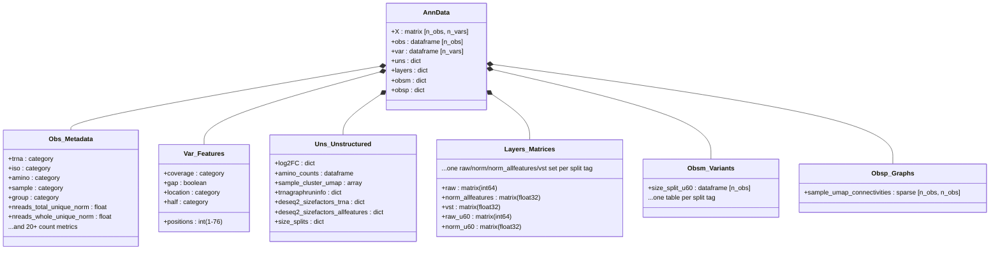

# Data Structure Reference

tRNAgraph relies on the [AnnData](https://anndata.readthedocs.io/en/latest/index.html) (`.h5ad`) format to store high-dimensional tRNA sequencing data. Unlike standard single-cell RNA-seq objects where observations are cells and variables are genes, tRNAgraph uses a specialized schema to handle the positional coverage and modification data unique to tRNA biology.

> [!IMPORTANT]
> Many of the coverage types and outputs are derived from [tRAX](https://github.com/UCSC-LoweLab/tRAX) alignments, classifications, and style conventions. For further details on how reads are categorized or referred to, check the tRAX documentation.

This document details the schema of the `adata` object, the normalization methods applied, and the biological definitions of the stored metrics.

---



## 1. The Data Matrix (`adata.X` and `adata.layers`)

The core matrix contains coverage depth information. Because tRAX generates multiple types of coverage tracks (e.g., read starts, mutations, read depth), the specific data contained in `X` depends on how the object is sliced by the `var` columns.

### Normalization Logic

tRNAgraph inherits normalization logic from DESeq2.

- **Raw Counts**: Integer counts of reads mapping to a feature.
- **Normalized Counts**: Raw counts divided by the **DESeq2 Size Factor** associated with the sample.
- DESeq2 size factors are always computed twice: once using only tRNA/tRX features as the normalization reference (the **default**), and once using all features (tRNAs + non-tRNA GTF features) as the reference. `adata.X` and `adata.layers["raw"]` are always built from the tRNA-controlled (default) size factors; the all-feature-controlled normalization is kept alongside it in `adata.layers["norm_allfeatures"]` for comparison. See `adata.uns` below for the corresponding per-sample size factor values.

### Layers

To ensure reproducibility and allow for on-the-fly re-normalization, data is stored in multiple states:

| Layer                            | Accessor                           | Description                                                                                                                |
| :------------------------------- | :--------------------------------- | :------------------------------------------------------------------------------------------------------------------------- |
| **Normalized (tRNA-controlled)** | `adata.X`                          | Float32. Coverage depth normalized by tRNA/tRX-controlled sample size factors (default). Used for all plotting by default. |
| **Normalized (all-feature)**     | `adata.layers["norm_allfeatures"]` | Float32. Coverage depth normalized by all-feature-controlled sample size factors, for comparison against the default.      |
| **Raw**                          | `adata.layers["raw"]`              | Int64. Raw alignment counts derived directly from BAM files.                                                               |

### Split Variants (`--readlengthsplit`)

A tRNAgraph object can hold the full (unsplit) dataset alongside one or more **read-length split variants** — e.g. reads under 60bp and reads 60bp-and-over — all within the same object. `trnagraph analyze build --readlengthsplit N` adds an under/over cutoff pair (tagged `u<N>`/`o<N>`) at build time; `trnagraph analyze addsplit -c N` adds further cutoffs to an existing object later, without disturbing variants already present. See [CLI Reference: addsplit](cli_reference.md#addsplit).

Because a length split only changes *which reads* contribute to coverage — it doesn't add a new tRNA or sample — each variant reuses the object's existing `obs`/`var` shape and is stored as a set of additional, tag-suffixed entries:

- **Layers**: each of `raw`/`norm` (the default-normalized data — this can't reuse `adata.X`, since `.X` is singular and already holds the full/unsplit default)/`norm_allfeatures`/`vst` (if built) has a `_<tag>` suffixed sibling per variant, e.g. `adata.layers['raw_u60']`, `adata.layers['norm_u60']`, `adata.layers['norm_allfeatures_u60']`, `adata.layers['vst_u60']`. `<tag>` is `u<N>` (under) or `o<N>` (over).
- **`adata.obsm['size_split_<tag>']`**: a single DataFrame, indexed identically to `adata.obs`, holding every per-obs numeric column that variant needs (`deseq2_sizefactor`, `nreads_<readtype>_raw`/`_norm`, etc.) under the exact same (unsuffixed) column names used in the default `adata.obs` — and, once `analyze cluster --variant norm:<tag>` has been run for that variant, its cluster labels/UMAP coordinates too. `adata.obs` itself holds only the full/default variant's numeric columns; identity columns (`trna`, `sample`, `group`, `amino`, ...) are shared across all variants.
- **`adata.uns['size_splits'][tag]`**: everything else split-specific — see [§4 Unstructured Data](#4-unstructured-data-adatauns) below.
- **`adata.obsp`**: the sample-level UMAP neighbor graph from clustering, see [Clustering Results](#clustering-results) below.

A single `--variant <norm>:<tag>` flag (default `norm:full`) on `graph`, `analyze cluster`, and `tools log2fc` selects which variant a plot/cluster run/DE calculation is built from — `<norm>` is one of `norm`/`raw`/`allfeatures`/`vst`, `<tag>` is `full` or an added split tag. The same flag also covers the plain (non-split) "plot raw counts instead of normalized" case via `--variant raw:full`. Internally, the requested variant is resolved **once**, into a working copy where `.X` is swapped to the right layer and the split's `obsm` columns/relevant `uns` entries are overlaid onto `.obs`/`.uns` under their normal unsuffixed names — so plotting code reads `adata.X`/`adata.obs['nreads_total_unique_norm']`/`adata.uns['nontRNA_counts']` exactly as it does for the full/default variant, regardless of which variant was requested.

> [!IMPORTANT]
> Each split variant gets its **own independently-fit** DESeq2 size factors/dispersion, computed from that variant's own read-length-restricted BAMs — not a shared/global normalization derived from the full dataset. This is intentional: a split subset's read-depth and length-composition profile can differ substantially from the full dataset, so sharing size factors across variants would bias comparisons within a split subset.

> [!NOTE]
> The read-length-restricted `u<N>`/`o<N>` BAM files used to compute a variant are scratch files, not a retained output — by default they're deleted once merged into the AnnData object, since only the resulting layers/`obsm`/`uns` entries above (plus the `results_<tag>`/`graphs_<tag>` directories) need to persist. Pass `--savesplitbams` to `build`/`addsplit` to keep them under `--bamdir` instead.

### On-Disk Result Files (`results/<exp>/`)

`trnagraph analyze build` always runs DESeq2 twice on the main feature matrix and writes both sets of outputs to disk before they're loaded into the `.h5ad`. The default (tRNA-controlled) run's files keep their original, unprefixed names at the top of `results/<exp>/`; the secondary (all-feature-controlled) run's files live in an `allfeature/` subdirectory with an `allfeature_` filename prefix:

| Output                           | Default (tRNA-controlled) — `results/<exp>/` | Secondary (all-feature) — `results/<exp>/allfeature/` |
| :------------------------------- | :------------------------------------------- | :---------------------------------------------------- |
| Size factors                     | `<exp>-SizeFactors.txt`                      | `<exp>-allfeature_SizeFactors.txt`                    |
| Normalized counts                | `<exp>-normalizedreadcounts.txt`             | `<exp>-allfeature_normalizedreadcounts.txt`           |
| Dispersions                      | `<exp>-dispersions.txt`                      | `<exp>-allfeature_dispersions.txt`                    |
| Per-condition avgs               | `<exp>-avgs.txt`                             | `<exp>-allfeature_avgs.txt`                           |
| Per-condition medians            | `<exp>-medians.txt`                          | `<exp>-allfeature_medians.txt`                        |
| Adjusted p-values                | `<exp>-padjs.txt`                            | `<exp>-allfeature_padjs.txt`                          |
| Log2 fold changes                | `<exp>-logvals.txt`                          | `<exp>-allfeature_logvals.txt`                        |
| Combined DE summary              | `<exp>-combine.txt`                          | `<exp>-allfeature_combine.txt`                        |
| Pairwise DE (if `--pairs` given) | `de_results/<cond1>_vs_<cond2>.txt`          | `allfeature/de_results/<cond1>_vs_<cond2>.txt`        |

The default (tRNA-controlled) size factors and normalized counts are what get read back into the `.h5ad` (`adata.uns['deseq2_sizefactors_trna']`, `adata.X`); the all-feature-controlled size factors are also read back in as `adata.uns['deseq2_sizefactors_allfeatures']` and used to derive `adata.layers['norm_allfeatures']`. The rest of the `allfeature/`-prefixed files (dispersions, avgs, medians, padjs, logvals, combine, pairwise DE) are written to disk for reference/comparison but are not loaded into the `.h5ad` object. This mirrors the existing pattern used for the tRNA-only-matrix DESeq2 run, whose outputs live under `results/<exp>/trna/`.

---

## 2. Observations (`adata.obs`)

The `obs` dataframe serves as the primary index for biological entities. In tRNAgraph, an "observation" is typically a specific **tRNA gene within a specific Sample**.

### Biological Metadata

These columns define the identity of the tRNA molecule.

| Column        | Type     | Description                                                                         |
| :------------ | :------- | :---------------------------------------------------------------------------------- |
| `trna`        | Category | The unique identifier for the tRNA gene (e.g., `tRNA-Ala-AGC-1-1`).                 |
| `iso`         | Category | The tRNA Isotype (e.g., `Ala`, `Gly`, `Ser`).                                       |
| `amino`       | Category | The Amino Acid group (synonymous with Isotype in most contexts).                    |
| `anticodon`   | Category | The 3-nucleotide anticodon sequence (e.g., `AGC`).                                  |
| `pseudogene`  | Boolean  | `True` if the gene is annotated as a pseudo-tRNA or tRX.                            |
| `refseq`      | String   | The reference sequence trimmed to the canonical Sprinzl alignment (Positions 1-76). |
| `refseq_full` | String   | The full reference sequence including variable loops and extensions.                |

### Experimental Metadata

These columns are imported from the user-provided `metadata.tsv` file.

| Column              | Type     | Description                                                                                                                                                       |
| :------------------ | :------- | :---------------------------------------------------------------------------------------------------------------------------------------------------------------- |
| `sample`            | Category | The sample identifier (matches FASTQ/BAM filenames).                                                                                                              |
| `group`             | Category | Experimental grouping (e.g., `Control`, `Treatment`).                                                                                                             |
| `deseq2_sizefactor` | Float    | The tRNA/tRX-controlled (default) DESeq2 size factor for the sample. See `adata.uns["deseq2_sizefactors_trna"]` / `deseq2_sizefactors_allfeatures` for both sets. |
| `dataset`           | Category | Label for the source dataset (useful after `merge` operations).                                                                                                   |

### Read Count Aggregates

tRNAgraph aggregates total read counts per tRNA into `obs`. These columns allow for bulk analysis (e.g., Differential Expression) without querying position-specific coverage.

#### Uniquely Mapped Reads

Reads that align to **only one** transcript in the database. These are the most reliable for quantifying specific isodecoders.

| Column                     | Description                                                                       |
| :------------------------- | :-------------------------------------------------------------------------------- |
| `nreads_whole_unique`      | Reads covering the full mature tRNA (start to end).                               |
| `nreads_fiveprime_unique`  | 5' fragments (start at position 1, terminate before end).                         |
| `nreads_threeprime_unique` | 3' fragments (terminate at end, start after position 1).                          |
| `nreads_other_unique`      | Internal fragments not anchoring to either the 5' or 3' ends (e.g., "antisense"). |
| `nreads_total_unique`      | Sum of all unique read types above.                                               |

#### Multi-Mapped Reads

Reads that align to multiple transcripts (common for conserved tRNA isodecoders). tRAX handles these using specific alignment strategies (e.g., random assignment among best hits or fractional counting).

| Column                    | Description                                                                                              |
| :------------------------ | :------------------------------------------------------------------------------------------------------- |
| `nreads_wholecounts`      | Total counts (Unique + Multi) for whole tRNAs.                                                           |
| `nreads_fiveprime`        | Total counts for 5' fragments.                                                                           |
| `nreads_threeprime`       | Total counts for 3' fragments.                                                                           |
| `nreads_other`            | Total counts for other internal fragments not anchoring to either the 5' or 3' ends (e.g., "antisense"). |
| `nreads_wholeprecounts`   | Reads mapping to Pre-tRNAs (including leader/trailer sequences).                                         |
| `nreads_partialprecounts` | Fragments of Pre-tRNAs.                                                                                  |
| `nreads_trailercounts`    | Reads mapping exclusively to the 3' trailer region.                                                      |

> [!NOTE]
> All count columns exist in pairs suffixed with `_raw` (integer) and `_norm` (float).

> [!CAUTION]
> The `other` category types are comprised of 'antisense', 'wholeprecounts', 'partialprecounts', and 'trailercounts' found via alignment and are highly dependent on the sequencing method.

### Extensions of the Observation Axis (`adata.obsm` / `adata.obsp`)

`adata.obsm` and `adata.obsp` share `adata.obs`'s row count and order, but hold observation-level data that doesn't fit as flat scalar columns:

- `adata.obsm['size_split_<tag>']`: a full table of per-observation numeric columns for one read-length split variant, mirroring `adata.obs`'s own numeric columns under the same names. See [Split Variants](#split-variants---readlengthsplit).
- `adata.obsp['sample_umap_connectivities'...]`: a sparse observation-by-observation matrix — the UMAP neighbor graph produced by clustering. See [Clustering Results](#clustering-results).

Keeping this data in `obsm`/`obsp` rather than as additional `obs` columns keeps `adata.obs` itself limited to identity/metadata columns plus the full/default variant's numeric columns, regardless of how many split variants or cluster runs an object accumulates.

---

## 3. Variables (`adata.var`)

The `var` dataframe defines the **dimensions of the coverage tracks**. It represents the canonical structural positions of the tRNA molecule.

| Column      | Type     | Description                                                                                                                 |
| :---------- | :------- | :-------------------------------------------------------------------------------------------------------------------------- |
| `positions` | Int      | Canonical [Sprinzl Coordinates](http://trna.ucsc.edu/tRNAscan-SE/Sprinzl.html) (Standardized 1-76 numbering).               |
| `gap`       | Boolean  | `True` if the position is a gap in the standard alignment (e.g., variable loop region in a short tRNA). Used to mask plots. |
| `coverage`  | Category | The specific data track type (see below).                                                                                   |
| `half`      | Category | Region assignment: `5prime_half`, `3prime_half`, or `center`.                                                               |
| `location`  | Category | Structural annotation: `acceptorstem`, `dloop`, `anticodonstem`, `anticodonloop`, `variableloop`, `tloop`, `tstem`.         |

### Coverage Types

The `coverage` column in `var` is critical for filtering `adata.X`. It distinguishes between different biological signals mapped to the same nucleotide position.

- **`uniquecoverage`**: Depth of uniquely mapped reads at this position.
- **`wholecoverage`**: Depth of reads classified as "Whole tRNAs".
- **`mismatchedbases`**: Count of reads containing a mismatch at this position (proxy for RNA modifications).
- **`deletions`**: Count of reads with a deletion at this position.
- **`readstarts`**: Count of reads beginning at this position (5' end definition).
- **`readends`**: Count of reads terminating at this position (3' end definition).

---

## 4. Unstructured Data (`adata.uns`)

Complex analysis results that do not fit into the 2D Obs/Var structure are stored here.

### Differential Expression (`log2FC`)

A nested dictionary containing pre-computed Differential Expression results.

- **Structure:** `adata.uns['log2FC'][<comparison_group>][<read_type>]`
  - _Example_: `adata.uns['log2FC']['Treatment_vs_Control']['nreads_total_unique_norm']`
- **Content:** Pandas DataFrames containing:
  - `log2FoldChange`: The effect size.
  - `padj`: FDR-corrected p-value.
  - `baseMean`: Average normalized expression.

### Clustering Results

If `trnagraph analyze cluster` has been run, dimensionality reduction coordinates are stored here (and usually mapped back to `obs` for plotting).

- `sample_cluster_umap`: UMAP coordinates (n_samples x 2).
- `group_cluster_umap`: Centroid UMAP coordinates for sample groups.
- `cluster_runinfo`: Parameters used for the clustering run (neighbors, metrics, etc.).
- `adata.obsp['sample_umap_connectivities']`: the sample-level pass's UMAP fuzzy-simplicial-set neighbor graph, sparse and sized `[n_obs, n_obs]`. Computed over a subset of samples (excluding those below `--readcutoff` and the `'Und'` amino-acid filter) and reindexed to the full object shape — rows/columns for excluded samples have all-zero connectivity. There is no group-level analog: the group-level clustering pass first collapses rows via a `trna`×`group` groupby, so its "observations" are a different axis than the top-level object's `trna`×`sample` obs and can't be expressed as an `[n_obs, n_obs]` matrix against it — group-level clustering stays `uns`-based only.

### Aggregate Counts

Pre-summed tables useful for bar charts and high-level overviews.

- `amino_counts`: Reads summed by Amino Acid.
- `anticodon_counts`: Reads summed by Anticodon.
- `nontRNA_counts`: Reads mapping to features defined in the external GTF (e.g., rRNA, mRNA).
- `type_counts`: Reads summed by Gene Type.

### Run Information

Provenance metadata for reproducibility.

- `trnagraphruninfo`: Provenance for the `trnagraph analyze build` run — `expname`, `time`, `trnagraph_directory`, `git version`, `git version hash`, and a `flags` sub-dict containing every CLI flag the `build` command was invoked with (e.g. `database`, `dispfittype`, `vst`, `nofrag`, `pairs`, ...). `None`-valued flags are stored as the string `'None'`.
- `deseq2_sizefactors_trna`: Per-sample DESeq2 size factors computed with tRNA/tRX features as the normalization reference (the default; identical to `adata.obs['deseq2_sizefactor']`).
- `deseq2_sizefactors_allfeatures`: Per-sample DESeq2 size factors computed with all features (tRNAs + non-tRNA GTF features) as the normalization reference — the secondary set backing `adata.layers['norm_allfeatures']`, kept for comparison against the default.

### Split Variants (`size_splits`)

`adata.uns['size_splits'][tag]` (`tag` = `u<N>`/`o<N>`) holds everything about one read-length split variant that isn't a flat layer/obsm/obsp entry (see [Split Variants](#split-variants---readlengthsplit) above). `'full'` is never a real key here — it's the reserved pseudo-tag meaning "read the unsuffixed/default location" used by `--variant`.

```python
adata.uns['size_splits']['u60'] = {
    'cutoff': 60, 'direction': 'under',                          # 'under' | 'over'
    'date_added': '2026-08-19T...', 'trnagraph_git_version': '...', 'trnagraph_git_hash': '...',
    'results_dir_name': 'results_u60', 'graphs_dir_name': 'graphs_u60',
    'build_flags': {...},                                        # sanitized snapshot of the args used to compute this variant
    'sizefactors_trna': {...}, 'sizefactors_allfeatures': {...},  # this variant's own independent DESeq2 fit
    'type_counts': DataFrame, 'type_real_counts': DataFrame, 'amino_counts': DataFrame,
    'anticodon_counts': DataFrame, 'nontRNA_counts': DataFrame,
    'log2FC': {...},           # same nested config_name/compare/readtype/cutoff structure as the top-level uns['log2FC']
    # populated only once `analyze cluster --variant norm:u60` has been run:
    'cluster_runinfo': {...}, 'sample_cluster_umap': DataFrame, 'group_cluster_umap': DataFrame,
}
```

---

## 5. Terminology Guide

### Sprinzl Coordinates

tRNAs vary in length, making positional comparison difficult. tRNAgraph standardizes all tRNAs to the **Sprinzl numbering system**, a canonical alignment (positions 1-76) based on the secondary structure (Cloverleaf).

- **Implication:** A read mapping to "Position 34" is always at the anticodon wobble position, regardless of the tRNA's actual length.
- **Gaps:** `adata.var['gap']` handles insertions/deletions relative to this standard.

### Fragment Types

tRNAgraph (via tRAX) categorizes reads into specific fragment classes based on alignment start/stop coordinates relative to the mature tRNA.

| Fragment Type                               | Definition                                                              | Biological Context                                                                     |
| :------------------------------------------ | :---------------------------------------------------------------------- | :------------------------------------------------------------------------------------- |
| **Whole**                                   | Read aligns to >90% of the mature tRNA, including the 3' CCA tail.      | Mature, aminoacylated tRNAs.                                                           |
| **5' Half** (`fiveprime_half`)              | Starts at pos 1, ends near the anticodon loop (~pos 30-40).             | Often stress-induced cleavage (e.g., Angiogenin).                                      |
| **5' Fragment** (`fiveprime_fragment`)      | Starts at pos 1, but is shorter than a half (<30nt).                    | Degradation products or specific tRFs.                                                 |
| **3' Half** (`threeprime_half`)             | Ends at the 3' CCA tail, starts near the anticodon loop.                | Often stress-induced cleavage.                                                         |
| **3' Fragment** (`threeprime_fragment`)     | Ends at the 3' CCA tail, but is shorter than a half.                    | tRF-3s.                                                                                |
| **Other / Internal** (`other_fragment`)     | Does not align to the 5' or 3' ends.                                    | Internal loop fragments.                                                               |
| **Multiple Fragment** (`multiple_fragment`) | Reads that "dip" in coverage in the middle (gapped alignment).          | Often caused by Reverse Transcriptase skipping over bulky modifications (e.g., m1G37). |
| **Trailer** (`trailercounts`)               | Aligns to the 3' trailer sequence downstream of the discriminator base. | tRF-1 / Pre-tRNA processing byproducts.                                                |

### Non-tRNA Features

If an Ensembl GTF file was provided during `trnagraph analyze build`, non-tRNA features (rRNA, snoRNA, mRNA) are included in the dataset but only included in the unstructured data (`adata.uns['nontRNA_counts']`). Unlike `adata.X`/`adata.obs`, these counts are normalized against the **all-feature-controlled** DESeq2 size factors (`adata.uns['deseq2_sizefactors_allfeatures']`), not the tRNA/tRX-controlled default — tRNA-controlled size factors are not representative of non-tRNA library composition. If no GTF was provided, `nontRNA_counts` is an empty DataFrame. See [Graphing Notes](#6-graphing-notes) for how this feeds into PCA and volcano plots.

---

## 6. Graphing Notes

Nuances specific to individual `trnagraph graph` plot types that aren't obvious from the schema alone.

### Selecting a Variant (`--variant`)

`--variant <norm>:<tag>` (default `norm:full`) selects which normalization and which split variant a plot is built from — see [Split Variants](#split-variants---readlengthsplit) above for the full mechanics. This is orthogonal to the tRNA/non-tRNA/combined families described below in [PCA Plots](#pca-plots)/[Volcano Plots](#volcano-plots): `--variant` picks the underlying data (e.g. raw counts, or a `u60` split), while those families are about which feature population (tRNA vs. non-tRNA vs. both) a given plot covers.

### PCA Plots

`trnagraph graph -g pca` generates two families of plots that use **different DESeq2 normalizations** and should not be compared directly:

- **`tRNA_<pcamarkers>_by_<pcacolors>_<readtype>_*`**: one set per `--pcareadtypes` value, built from `adata.obs['nreads_<readtype>_norm']` — normalized against the default **tRNA/tRX-controlled** size factors (`adata.uns['deseq2_sizefactors_trna']`), matching `adata.X`.
- **`nontRNA_<pcamarkers>_by_<pcacolors>_*`**: non-tRNA feature counts alone (`adata.uns['nontRNA_counts']`), normalized against the **all-feature-controlled** size factors (`adata.uns['deseq2_sizefactors_allfeatures']`).
- **`allRNA_<pcamarkers>_by_<pcacolors>_*`**: all tRNA reads (`total`, not unique-only) combined with non-tRNA feature counts, both normalized against the all-feature-controlled size factors. tRNA total counts are re-derived from raw counts (`adata.obs['nreads_total_raw']`) and re-normalized specifically for this comparison — they are **not** the same values used in the `tRNA_*` plots.

The `nontRNA_*` and `allRNA_*` plots require `adata.uns['nontRNA_counts']` to be present and non-empty (i.e., `--gtf` was provided at `analyze build`); they are skipped with a log message otherwise. See [Non-tRNA Features](#non-trna-features) and [Normalization Logic](#normalization-logic) for background on the two size factor sets.

### Volcano Plots

`trnagraph graph -g volcano` follows the same naming and normalization pattern as PCA, and (like coverage plots).

As with PCA, the non-tRNA and combined volcano plots require `adata.uns['nontRNA_counts']` to be present and non-empty (i.e., `--gtf` was provided at `analyze build`); they are skipped with a log message otherwise, and the combined overview page correspondingly drops to 2 plots. See [Non-tRNA Features](#non-trna-features) and [Normalization Logic](#normalization-logic) for background on the two size factor sets.

Points are classified significant when `|log2FoldChange| > 1.5` and `p < 0.05` (a second `p < 0.001` line is drawn as an additional, non-classifying reference). Significant points are colored by comparison direction using `--colormap`'s colors for `--volgrp` (falling back to a default red/blue if a group has no configured color) and drawn at full opacity; non-significant points are grey and drawn at reduced opacity. Labeling of significant points is controlled by `--vollabels` — see [CLI Reference: Volcano Options](cli_reference.md#graph).
