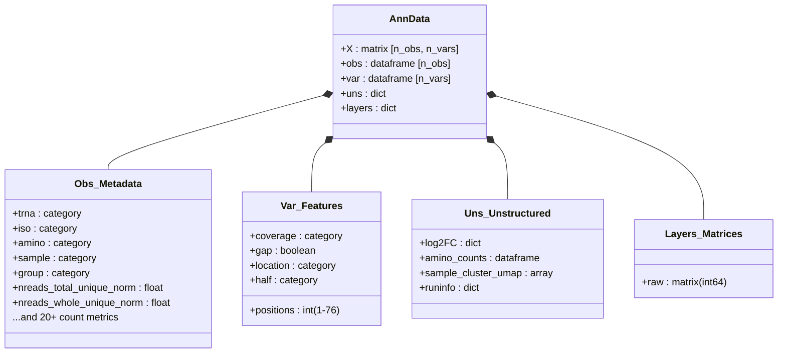

# Data Structure Reference

tRNAgraph relies on the [AnnData](https://anndata.readthedocs.io/en/latest/index.html) (`.h5ad`) format to store high-dimensional tRNA sequencing data. Unlike standard single-cell RNA-seq objects where observations are cells and variables are genes, tRNAgraph uses a specialized schema to handle the positional coverage and modification data unique to tRNA biology.

> [!IMPORTANT]
> Many of the coverage types and outputs are derived from [tRAX](https://github.com/UCSC-LoweLab/tRAX) alignments, classifications, and style conventions. For further details on how reads are categorized or referred to, check the tRAX documentation.

This document details the schema of the `adata` object, the normalization methods applied, and the biological definitions of the stored metrics.

---

## 1. The Data Matrix (`adata.X` and `adata.layers`)

The core matrix contains coverage depth information. Because tRAX generates multiple types of coverage tracks (e.g., read starts, mutations, read depth), the specific data contained in `X` depends on how the object is sliced by the `var` columns.

### Normalization Logic

tRNAgraph inherits normalization logic from DESeq2.

- **Raw Counts**: Integer counts of reads mapping to a feature.
- **Normalized Counts**: Raw counts divided by the **DESeq2 Size Factor** associated with the sample.

### Layers

To ensure reproducibility and allow for on-the-fly re-normalization, data is stored in two states:

| Layer          | Accessor              | Description                                                                                  |
| :------------- | :-------------------- | :------------------------------------------------------------------------------------------- |
| **Normalized** | `adata.X`             | Float32. Coverage depth normalized by sample size factors. Used for all plotting by default. |
| **Raw**        | `adata.layers["raw"]` | Int64. Raw alignment counts derived directly from BAM files.                                 |

---

## 2. Observations (`adata.obs`)

The `obs` dataframe serves as the primary index for biological entities. In tRNAgraph, an "observation" is typically a specific **tRNA gene within a specific Sample**.

### Biological Metadata

These columns define the identity of the tRNA molecule.

| Column        | Type     | Description                                                                         |
| :------------ | :------- | :---------------------------------------------------------------------------------- |
| `trna`        | Category | The unique identifier for the tRNA gene (e.g., `tRNA-Ala-AGC-1-1`).                 |
| `iso`         | Category | The tRNA Isotype (e.g., `Ala`, `Gly`, `Ser`).                                       |
| `amino`       | Category | The Amino Acid group (synonymous with Isotype in most contexts).                    |
| `anticodon`   | Category | The 3-nucleotide anticodon sequence (e.g., `AGC`).                                  |
| `pseudogene`  | Boolean  | `True` if the gene is annotated as a pseudo-tRNA or tRX.                            |
| `refseq`      | String   | The reference sequence trimmed to the canonical Sprinzl alignment (Positions 1-76). |
| `refseq_full` | String   | The full reference sequence including variable loops and extensions.                |

### Experimental Metadata

These columns are imported from the user-provided `metadata.tsv` file.

| Column              | Type     | Description                                                                          |
| :------------------ | :------- | :----------------------------------------------------------------------------------- |
| `sample`            | Category | The sample identifier (matches FASTQ/BAM filenames).                                 |
| `group`             | Category | Experimental grouping (e.g., `Control`, `Treatment`).                                |
| `deseq2_sizefactor` | Float    | The scaling factor calculated by DESeq2 to account for sequencing depth differences. |
| `dataset`           | Category | Label for the source dataset (useful after `merge` operations).                      |

### Read Count Aggregates

tRNAgraph aggregates total read counts per tRNA into `obs`. These columns allow for bulk analysis (e.g., Differential Expression) without querying position-specific coverage.

#### Uniquely Mapped Reads

Reads that align to **only one** transcript in the database. These are the most reliable for quantifying specific isodecoders.

| Column                     | Description                                                                       |
| :------------------------- | :-------------------------------------------------------------------------------- |
| `nreads_whole_unique`      | Reads covering the full mature tRNA (start to end).                               |
| `nreads_fiveprime_unique`  | 5' fragments (start at position 1, terminate before end).                         |
| `nreads_threeprime_unique` | 3' fragments (terminate at end, start after position 1).                          |
| `nreads_other_unique`      | Internal fragments not anchoring to either the 5' or 3' ends (e.g., "antisense"). |
| `nreads_total_unique`      | Sum of all unique read types above.                                               |

#### Multi-Mapped Reads

Reads that align to multiple transcripts (common for conserved tRNA isodecoders). tRAX handles these using specific alignment strategies (e.g., random assignment among best hits or fractional counting).

| Column                    | Description                                                                                              |
| :------------------------ | :------------------------------------------------------------------------------------------------------- |
| `nreads_wholecounts`      | Total counts (Unique + Multi) for whole tRNAs.                                                           |
| `nreads_fiveprime`        | Total counts for 5' fragments.                                                                           |
| `nreads_threeprime`       | Total counts for 3' fragments.                                                                           |
| `nreads_other`            | Total counts for other internal fragments not anchoring to either the 5' or 3' ends (e.g., "antisense"). |
| `nreads_wholeprecounts`   | Reads mapping to Pre-tRNAs (including leader/trailer sequences).                                         |
| `nreads_partialprecounts` | Fragments of Pre-tRNAs.                                                                                  |
| `nreads_trailercounts`    | Reads mapping exclusively to the 3' trailer region.                                                      |

> [!NOTE]
> All count columns exist in pairs suffixed with `_raw` (integer) and `_norm` (float).

> [!CAUTION]
> The `other` category types are comprised of 'antisense', 'wholeprecounts', 'partialprecounts', and 'trailercounts' found via alignment and are highly dependent on the sequencing method.

---

## 3. Variables (`adata.var`)

The `var` dataframe defines the **dimensions of the coverage tracks**. It represents the canonical structural positions of the tRNA molecule.

| Column      | Type     | Description                                                                                                                 |
| :---------- | :------- | :-------------------------------------------------------------------------------------------------------------------------- |
| `positions` | Int      | Canonical [Sprinzl Coordinates](http://trna.ucsc.edu/tRNAscan-SE/Sprinzl.html) (Standardized 1-76 numbering).               |
| `gap`       | Boolean  | `True` if the position is a gap in the standard alignment (e.g., variable loop region in a short tRNA). Used to mask plots. |
| `coverage`  | Category | The specific data track type (see below).                                                                                   |
| `half`      | Category | Region assignment: `5prime_half`, `3prime_half`, or `center`.                                                               |
| `location`  | Category | Structural annotation: `acceptorstem`, `dloop`, `anticodonstem`, `anticodonloop`, `variableloop`, `tloop`, `tstem`.         |

### Coverage Types

The `coverage` column in `var` is critical for filtering `adata.X`. It distinguishes between different biological signals mapped to the same nucleotide position.

- **`uniquecoverage`**: Depth of uniquely mapped reads at this position.
- **`wholecoverage`**: Depth of reads classified as "Whole tRNAs".
- **`mismatchedbases`**: Count of reads containing a mismatch at this position (proxy for RNA modifications).
- **`deletions`**: Count of reads with a deletion at this position.
- **`readstarts`**: Count of reads beginning at this position (5' end definition).
- **`readends`**: Count of reads terminating at this position (3' end definition).

---

## 4. Unstructured Data (`adata.uns`)

Complex analysis results that do not fit into the 2D Obs/Var structure are stored here.

### Differential Expression (`log2FC`)

A nested dictionary containing pre-computed Differential Expression results.

- **Structure:** `adata.uns['log2FC'][<comparison_group>][<read_type>]`
  - _Example_: `adata.uns['log2FC']['Treatment_vs_Control']['nreads_total_unique_norm']`
- **Content:** Pandas DataFrames containing:
  - `log2FoldChange`: The effect size.
  - `padj`: FDR-corrected p-value.
  - `baseMean`: Average normalized expression.

### Clustering Results

If `trnagraph analyze cluster` has been run, dimensionality reduction coordinates are stored here (and usually mapped back to `obs` for plotting).

- `sample_cluster_umap`: UMAP coordinates (n_samples x 2).
- `group_cluster_umap`: Centroid UMAP coordinates for sample groups.
- `cluster_runinfo`: Parameters used for the clustering run (neighbors, metrics, etc.).

### Aggregate Counts

Pre-summed tables useful for bar charts and high-level overviews.

- `amino_counts`: Reads summed by Amino Acid.
- `anticodon_counts`: Reads summed by Anticodon.
- `nontRNA_counts`: Reads mapping to features defined in the external GTF (e.g., rRNA, mRNA).
- `type_counts`: Reads summed by Gene Type.

### Run Information

Provenance metadata for reproducibility.

- `trnagraphruninfo`: Parameters used during the `trnagraph analyze build` command.

---

## 5. Terminology Guide

### Sprinzl Coordinates

tRNAs vary in length, making positional comparison difficult. tRNAgraph standardizes all tRNAs to the **Sprinzl numbering system**, a canonical alignment (positions 1-76) based on the secondary structure (Cloverleaf).

- **Implication:** A read mapping to "Position 34" is always at the anticodon wobble position, regardless of the tRNA's actual length.
- **Gaps:** `adata.var['gap']` handles insertions/deletions relative to this standard.

### Fragment Types

tRNAgraph (via tRAX) categorizes reads into specific fragment classes based on alignment start/stop coordinates relative to the mature tRNA.

| Fragment Type                               | Definition                                                              | Biological Context                                                                     |
| :------------------------------------------ | :---------------------------------------------------------------------- | :------------------------------------------------------------------------------------- |
| **Whole**                                   | Read aligns to >90% of the mature tRNA, including the 3' CCA tail.      | Mature, aminoacylated tRNAs.                                                           |
| **5' Half** (`fiveprime_half`)              | Starts at pos 1, ends near the anticodon loop (~pos 30-40).             | Often stress-induced cleavage (e.g., Angiogenin).                                      |
| **5' Fragment** (`fiveprime_fragment`)      | Starts at pos 1, but is shorter than a half (<30nt).                    | Degradation products or specific tRFs.                                                 |
| **3' Half** (`threeprime_half`)             | Ends at the 3' CCA tail, starts near the anticodon loop.                | Often stress-induced cleavage.                                                         |
| **3' Fragment** (`threeprime_fragment`)     | Ends at the 3' CCA tail, but is shorter than a half.                    | tRF-3s.                                                                                |
| **Other / Internal** (`other_fragment`)     | Does not align to the 5' or 3' ends.                                    | Internal loop fragments.                                                               |
| **Multiple Fragment** (`multiple_fragment`) | Reads that "dip" in coverage in the middle (gapped alignment).          | Often caused by Reverse Transcriptase skipping over bulky modifications (e.g., m1G37). |
| **Trailer** (`trailercounts`)               | Aligns to the 3' trailer sequence downstream of the discriminator base. | tRF-1 / Pre-tRNA processing byproducts.                                                |

### Non-tRNA Features

If an Ensembl GTF file was provided during `trnagraph analyze build`, non-tRNA features (rRNA, snoRNA, mRNA) are included in the dataset but only included in the unstructured data (`adata.uns['nontRNA_counts']`).
